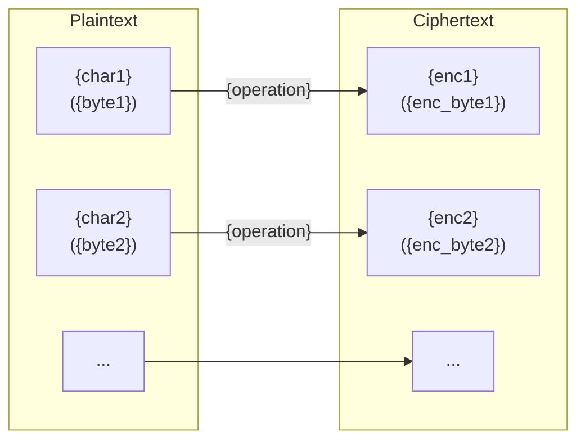
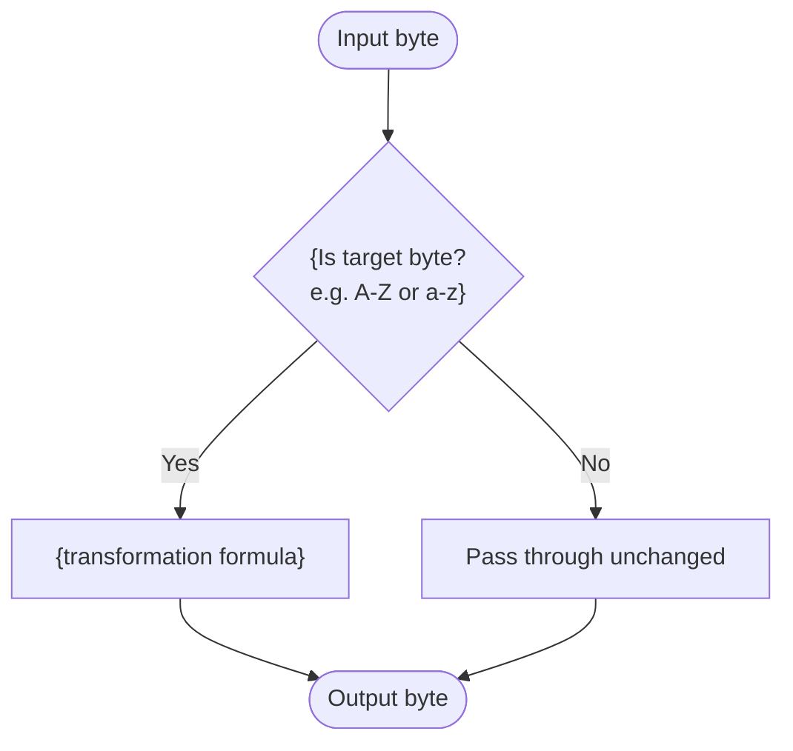

# {Cipher Name}

> {One-line description, e.g. "A monoalphabetic substitution cipher that shifts each letter by a fixed amount."}

## Overview

{2-3 sentences: what it is, when developed, historical context and use.}

## How It Works

{2-4 sentences explaining the algorithm in plain language, no code.}



### Algorithm



## API

```python
from hordekit.crypto.classical.{category} import {ClassName}

cipher = {ClassName}({params})
cipher.encrypt(b"{example}")   # -> HordeResult
cipher.decrypt(b"{encrypted}") # -> HordeResult
```

### Parameters

| Parameter | Type | Description |
|-----------|------|-------------|
| `{param}` | `{type}` | {description} |

### Chaining

```python
result = (
    {ClassName}({params}).encrypt(b"{example}")
    .pipe(AnotherTool, ...)
    .as_hex()
)
```

## Known Attacks

| Attack | When applicable |
|--------|----------------|
| [Brute force](../../attacks/generic/brute_force.md) | Key space is small and enumerable |
| {Other attack} | {condition} |

## References

- [{Source name}]({url})
