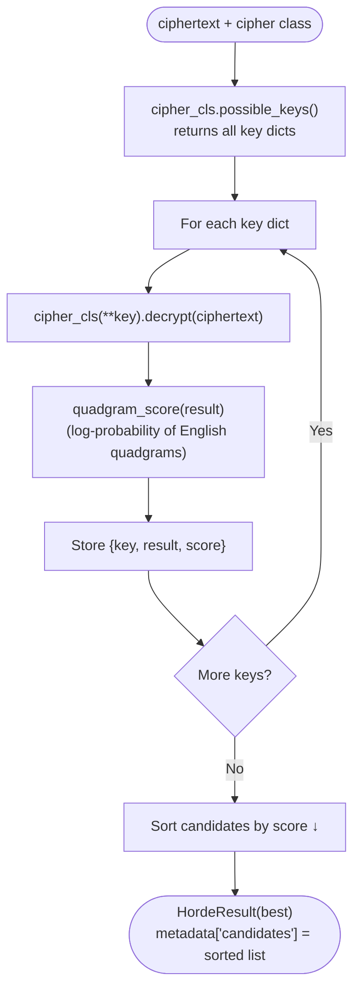

# Brute Force Attack

> Try every possible key from a cipher's enumerable key space and return the best-scoring decryption.

## Overview

Brute force is the simplest and most reliable attack when the key space is small enough to exhaust. It asks the cipher for its full list of possible keys via `possible_keys()`, decrypts the ciphertext with each one, scores each candidate against a statistical model of English, and returns the best match.

**When to use**: any cipher that implements `possible_keys()` — [Caesar](../../classical/substitution/caesar.md) (25 keys), [ROT13](../../classical/substitution/rot13.md) (1 key), [Atbash](../../classical/substitution/atbash.md) (1 key), [Affine](../../classical/substitution/affine.md) (312 keys). Not practical for [Vigenère](../../classical/substitution/vigenere.md) (key space is unbounded).

## How It Works



### Scoring

The default scorer is **quadgram log-probability**: it looks up every 4-letter substring of the decryption in a pre-built English frequency table and sums their log probabilities. Longer English text produces a score close to zero; random-looking text scores much lower. This is significantly more accurate than monogram scoring, especially for short texts.

You can substitute any `(bytes) -> float` function via the `scorer` parameter.

## API

```python
from hordekit.crypto.attacks.generic import brute_force
from hordekit.crypto.classical.substitution import Caesar, Affine

# Caesar — 25 keys tried automatically
result = brute_force(Caesar, b"Khoor Zruog")
print(result.as_str())                            # Hello World
print(result.metadata["candidates"][0]["key"])    # {'shift': 3}
print(result.metadata["candidates"][0]["score"])  # highest score

# Affine — 312 keys tried automatically
result = brute_force(Affine, b"IHHWVCSWFRCP")
print(result.metadata["candidates"][0]["key"])    # {'a': 5, 'b': 8}
```

### Custom scorer

```python
from hordekit.crypto.attacks.scoring import bigram_score
from hordekit.crypto.attacks.generic import brute_force
from hordekit.crypto.classical.substitution import Caesar

result = brute_force(Caesar, ciphertext, scorer=bigram_score)
```

### Signature

```python
def brute_force(
    cipher_cls: type[BaseCipher],
    ciphertext: bytes,
    scorer: Callable[[bytes], float] | None = None,
) -> HordeResult: ...
```

| Parameter | Type | Description |
|-----------|------|-------------|
| `cipher_cls` | `type[BaseCipher]` | Cipher class — must implement `possible_keys()` |
| `ciphertext` | `bytes` | Encrypted bytes to attack |
| `scorer` | `Callable[[bytes], float] \| None` | Scoring function. Default: `quadgram_score` (higher = more English-like) |

### Return value

`HordeResult` whose bytes are the best decryption. `metadata["candidates"]` is a list of dicts sorted by score descending — each entry has `key`, `result` (`HordeResult`), and `score`.

## Supported ciphers

| Cipher | Keys | Import |
|--------|------|--------|
| [Caesar](../../classical/substitution/caesar.md) | 25 | `hordekit.crypto.classical.substitution.Caesar` |
| [ROT13](../../classical/substitution/rot13.md) | 1 | `hordekit.crypto.classical.substitution.ROT13` |
| [Atbash](../../classical/substitution/atbash.md) | 1 | `hordekit.crypto.classical.substitution.Atbash` |
| [Affine](../../classical/substitution/affine.md) | 312 | `hordekit.crypto.classical.substitution.Affine` |

## Limitations

- Requires `possible_keys()` on the cipher class — [Vigenère](../../classical/substitution/vigenere.md) does not have one.
- Scoring is statistical: very short ciphertexts (< ~40 characters) may return the wrong key. Use longer ciphertexts or [dictionary_attack](dictionary.md) with a curated wordlist.
- Only decrypts in the default direction (`decrypt()`). Ciphers where `run()` maps to `encrypt()` are not affected.

## See also

- [Dictionary Attack](dictionary.md) — when you have a candidate wordlist instead of exhausting all keys
- [Frequency Analysis](../substitution/frequency.md) — alternative for monoalphabetic ciphers
- Scoring utilities: `from hordekit.crypto.attacks.scoring import monogram_score, bigram_score, trigram_score, quadgram_score`

## References

- [Quadgram statistics — Practical Cryptography](http://practicalcryptography.com/cryptanalysis/text-characterisation/quadgrams/)
