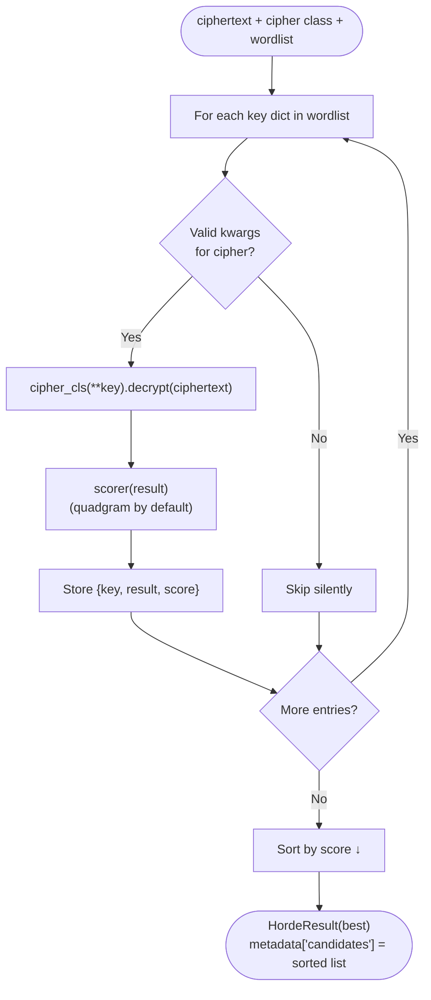

# Dictionary Attack

> Try a curated wordlist of candidate keys and return the best-scoring decryption.

## Overview

A dictionary attack is the right tool when you have a hypothesis about what the key might look like — a list of common words, short phrases, known passwords, or previously leaked keys — but the cipher's key space is too large to brute-force exhaustively (e.g. [Vigenère](../../classical/substitution/vigenere.md)).

Unlike [brute force](brute_force.md), which asks the cipher for all possible keys via `possible_keys()`, a dictionary attack accepts an **explicit wordlist** of kwarg dicts. You decide what to try.

## How It Works



Invalid key dicts (wrong kwargs, bad values) are silently skipped — the attack returns the best of whatever succeeded.

## API

```python
from hordekit.crypto.attacks.generic import dictionary_attack
from hordekit.crypto.classical.substitution import Vigenere, Caesar

# Vigenere — try common keyword candidates
wordlist = [{"key": b"apple"}, {"key": b"lemon"}, {"key": b"secret"}, {"key": b"crypto"}]
result = dictionary_attack(Vigenere, ciphertext, wordlist)
print(result.as_str())
print(result.metadata["candidates"][0]["key"])   # e.g. {'key': b'lemon'}

# Caesar — same API, wordlist overrides possible_keys()
wordlist = [{"shift": s} for s in [3, 7, 13, 17]]
result = dictionary_attack(Caesar, ciphertext, wordlist)
```

### Custom scorer

```python
from hordekit.crypto.attacks.scoring import trigram_score
from hordekit.crypto.attacks.generic import dictionary_attack

result = dictionary_attack(Vigenere, ciphertext, wordlist, scorer=trigram_score)
```

### Signature

```python
def dictionary_attack(
    cipher_cls: type[BaseCipher],
    ciphertext: bytes,
    wordlist: list[dict[str, Any]],
    scorer: Callable[[bytes], float] | None = None,
) -> HordeResult: ...
```

| Parameter | Type | Description |
|-----------|------|-------------|
| `cipher_cls` | `type[BaseCipher]` | Cipher class to instantiate for each key |
| `ciphertext` | `bytes` | Encrypted bytes to attack |
| `wordlist` | `list[dict[str, Any]]` | List of kwarg dicts, e.g. `[{"key": b"lemon"}, ...]` |
| `scorer` | `Callable[[bytes], float] \| None` | Scoring function. Default: `quadgram_score` |

### Return value

`HordeResult` whose bytes are the best decryption. `metadata["candidates"]` is a list sorted by score descending — each entry has `key` (the kwargs dict), `result` (`HordeResult`), and `score`.

Raises `ValueError` if the wordlist is empty or all keys were invalid.

## Building a wordlist

```python
# From a file (one key per line)
with open("common_keys.txt") as f:
    wordlist = [{"key": line.strip().encode()} for line in f]

# All Caesar shifts (same as brute_force for Caesar)
wordlist = [{"shift": s} for s in range(1, 26)]

# Affine keys with a fixed multiplier
wordlist = [{"a": 5, "b": b} for b in range(26)]
```

## vs. Brute Force

| | Brute Force | Dictionary Attack |
|---|---|---|
| Key source | `cipher_cls.possible_keys()` | Your wordlist |
| Use when | Key space is small and enumerable | You have key candidates |
| Works with Vigenère | No | Yes |
| Flexible | No | Yes |

## See also

- [Brute Force](brute_force.md) — exhaustive search for ciphers with `possible_keys()`
- [Kasiski Test](../vigenere/kasiski.md) — find likely Vigenère key length first, then attack
- [Index of Coincidence](../substitution/ioc.md) — confirm key length before building a wordlist
