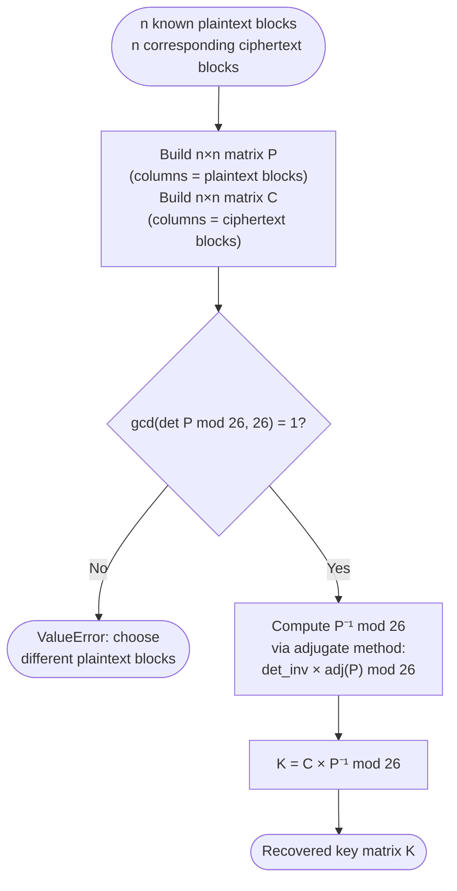

# Hill Cipher — Known-Plaintext Attack

> Recovers the full Hill cipher key matrix from n² known plaintext/ciphertext letter pairs using modular matrix inversion.

## Overview

The Hill cipher encrypts each block as $\mathbf{c} = K \cdot \mathbf{p} \pmod{26}$. If you can observe n corresponding plaintext and ciphertext blocks (each of length n), you can arrange them into two n×n matrices P and C satisfying $K \cdot P = C \pmod{26}$, then recover K directly:

$$
K = C \cdot P^{-1} \pmod{26}
$$

This requires P to be invertible mod 26 — i.e., $\gcd(\det P, 26) = 1$. The attack is **complete**: it recovers the exact key, not just an approximation, and scales to any matrix size.

**When to use:**

- You have at least n² known plaintext/ciphertext letter pairs.
- The standard scenario: known file headers, fixed protocol fields, or cribs (guessed plaintext words).

## Algorithm



### Matrix inverse mod 26

Because 26 is not prime, Z/26Z is not a field. The standard adjugate approach still works:

$$
P^{-1} \equiv \det(P)^{-1} \cdot \mathrm{adj}(P) \pmod{26}
$$

where $\mathrm{adj}(P)$ is the transpose of the cofactor matrix and $\det(P)^{-1}$ is the modular inverse of $\det(P) \bmod 26$ (exists iff $\gcd(\det P,\, 26) = 1$).

## API

```python
from hordekit.crypto.attacks.hill import hill_known_plaintext
from hordekit.crypto.classical.substitution import Hill

# Suppose we intercepted ciphertext and know some plaintext
key = [[3, 3], [2, 5]]
plaintext  = b"HELP"   # 4 letters = 2² pairs for a 2×2 cipher
ciphertext = Hill(key).encrypt(plaintext).as_bytes()  # b"HIAT"

result = hill_known_plaintext(plaintext, ciphertext, n=2)

print(result.metadata["key_matrix"])  # [[3, 3], [2, 5]]
print(result.as_bytes())               # b'\x03\x03\x02\x05'  (flattened key)

# Use recovered key to decrypt arbitrary ciphertext
recovered_cipher = Hill(result.metadata["key_matrix"])
recovered_cipher.decrypt(ciphertext).as_str()  # "HELP"
```

### Parameters

| Parameter    | Type    | Description                                                           |
|--------------|---------|-----------------------------------------------------------------------|
| `plaintext`  | `bytes` | Known plaintext — at least n² alphabetic characters (non-alpha ignored) |
| `ciphertext` | `bytes` | Corresponding ciphertext — at least n² alphabetic characters           |
| `n`          | `int`   | Matrix dimension (2, 3, …)                                            |

### Return value

`HordeResult` where:

- `.as_bytes()` — flattened key matrix in row-major order, values 0–25.
- `.metadata["key_matrix"]` — recovered key as `list[list[int]]`, ready to pass to `Hill(key=...)`.
- `.metadata["n"]` — matrix dimension.

## See also

- [Hill Cipher](../../classical/substitution/hill.md) — full cipher documentation and API

## References

- [Wikipedia — Hill cipher §Cryptanalysis](https://en.wikipedia.org/wiki/Hill_cipher#Cryptanalysis)
- Stinson, D. *Cryptography: Theory and Practice*, CRC Press, 2006 — §2.3.
