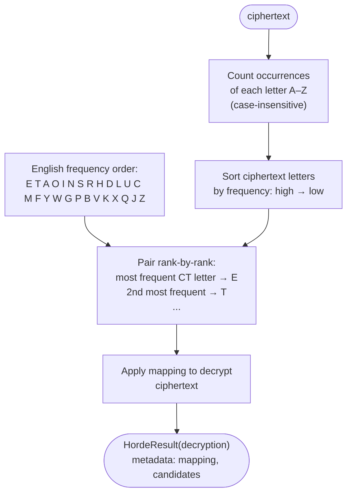

# Frequency Analysis

> Map letter frequencies in a ciphertext to the expected English frequency order to recover a monoalphabetic substitution mapping.

## Overview

Frequency analysis is the oldest and most famous cryptanalytic technique, first described by al-Kindi in the 9th century. It exploits the fact that in any monoalphabetic substitution cipher — [Caesar](../../classical/substitution/caesar.md), [Affine](../../classical/substitution/affine.md), [Atbash](../../classical/substitution/atbash.md), [ROT13](../../classical/substitution/rot13.md) — each plaintext letter always maps to the same ciphertext letter. So the most frequent ciphertext letter is likely `E`, the second most frequent is likely `T`, and so on.

**When to use**: monoalphabetic ciphers with sufficient ciphertext (100+ characters for reliable results). Does not work on [Vigenère](../../classical/substitution/vigenere.md) or any polyalphabetic cipher — use [IoC](ioc.md) first to confirm the cipher type.

## How It Works



### English letter frequency order

| Rank | 1 | 2 | 3 | 4 | 5 | 6 | 7 | 8 | 9 | 10 | 11 | 12 | 13 |
|------|---|---|---|---|---|---|---|---|---|----|----|----|-----|
| Letter | E | T | A | O | I | N | S | R | H | D  | L  | U  | C  |

| Rank | 14 | 15 | 16 | 17 | 18 | 19 | 20 | 21 | 22 | 23 | 24 | 25 | 26 |
|------|----|----|----|----|----|----|----|----|----|----|----|----|----|
| Letter | M | F | Y | W | G | P | B | V | K | X  | Q  | J  | Z  |

## API

```python
from hordekit.crypto.attacks.substitution import frequency_analysis

result = frequency_analysis(ciphertext)
print(result.as_str())                        # best decryption attempt
print(result.metadata["mapping"])             # {'K': 'E', 'H': 'T', ...}
print(result.metadata["candidates"])          # list of scored candidates
```

### Signature

```python
def frequency_analysis(ciphertext: bytes) -> HordeResult: ...
```

| Parameter | Type | Description |
|-----------|------|-------------|
| `ciphertext` | `bytes` | Encrypted bytes (letters only are analysed; other bytes pass through) |

### Return value

`HordeResult` with the best decryption attempt. `metadata` contains:

| Key | Type | Description |
|-----|------|-------------|
| `mapping` | `dict[str, str]` | Mapping from ciphertext letter → guessed plaintext letter |
| `candidates` | `list[dict]` | Scored decryption candidates |

## Limitations

- Requires **sufficient ciphertext**: with < 100 letters, the observed frequency ranking may not match English well.
- Produces a **statistical best guess**: the result often needs manual refinement since low-frequency letters are noisy.
- **Does not work on polyalphabetic ciphers** like [Vigenère](../../classical/substitution/vigenere.md). Use [Index of Coincidence](ioc.md) first to classify the cipher type.
- Language-dependent: assumes English plaintext.

## Example

```python
from hordekit.crypto.classical.substitution import Caesar
from hordekit.crypto.attacks.substitution import frequency_analysis

plaintext = b"when in the course of human events it becomes necessary for one people to dissolve"
ciphertext = Caesar(shift=7).encrypt(plaintext).as_bytes()

result = frequency_analysis(ciphertext)
print(result.as_str())           # decryption (may need refinement)
print(result.metadata["mapping"])
```

## See also

- [Index of Coincidence](ioc.md) — use first to confirm the cipher is monoalphabetic
- [Brute Force](../generic/brute_force.md) — more reliable for small key spaces (Caesar, Affine)
- [Kasiski Test](../vigenere/kasiski.md) — for Vigenère key length recovery

## References

- [Frequency analysis — Wikipedia](https://en.wikipedia.org/wiki/Frequency_analysis)
- [al-Kindi's manuscript on deciphering cryptographic messages](https://en.wikipedia.org/wiki/Al-Kindi)
- [Practical Cryptography — Frequency Analysis](http://practicalcryptography.com/cryptanalysis/text-characterisation/monograms-bigrams-and-trigrams/)
