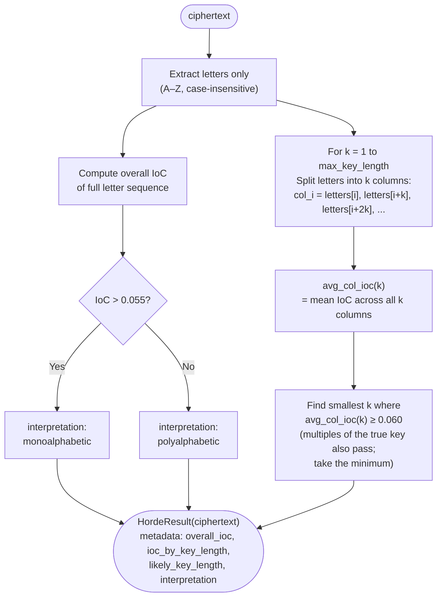

# Index of Coincidence

> Measure how "uneven" a text's letter distribution is to detect cipher type and estimate Vigenère key length.

## Overview

The Index of Coincidence (IoC), introduced by William Friedman in 1922, measures the probability that two randomly selected letters from a text are the same. English plaintext has IoC ≈ **0.065** because the frequency distribution is very uneven (lots of E and T, almost no Q and Z). A Vigenère ciphertext has IoC ≈ **0.038** because the polyalphabetic substitution flattens the distribution toward uniformity.

This makes IoC useful for two things:

1. **Identifying cipher type**: monoalphabetic vs. polyalphabetic
2. **Finding Vigenère key length**: split the ciphertext into *k* columns; when *k* equals the key length, each column is a monoalphabetic cipher and its IoC rises back to ~0.065

**When to use**: before frequency analysis or brute force — to confirm you're dealing with the right cipher type. Essential first step before attacking [Vigenère](../../classical/substitution/vigenere.md).

## How It Works

### Formula

$$\text{IoC} = \frac{\sum_{i=A}^{Z} n_i (n_i - 1)}{N (N - 1)}$$

where $n_i$ is the count of letter $i$ and $N$ is the total number of letters.

### Algorithm



### Why the smallest key length?

Multiples of the true key length (2k, 3k, …) also produce high column IoC, because the key repeats at those intervals too. By selecting the **smallest** k above the threshold we find the minimal — and therefore most likely correct — key length.

## Reference values

| Text type | Expected IoC |
|-----------|-------------|
| English plaintext | ~0.065 |
| Monoalphabetic ciphertext | ~0.065 (distribution preserved) |
| Vigenère (key len 2) | ~0.052 |
| Vigenère (key len 5) | ~0.044 |
| Vigenère (key len 10+) | ~0.040 |
| Purely random | ~0.038 |

## API

```python
from hordekit.crypto.attacks.substitution import index_of_coincidence

result = index_of_coincidence(ciphertext)
print(result.metadata["overall_ioc"])          # e.g. 0.042
print(result.metadata["interpretation"])        # "polyalphabetic"
print(result.metadata["likely_key_length"])     # e.g. 5
print(result.metadata["ioc_by_key_length"])     # {1: 0.042, 2: 0.044, ..., 5: 0.063, ...}
```

### Signature

```python
def index_of_coincidence(
    ciphertext: bytes,
    max_key_length: int = 20,
) -> HordeResult: ...
```

| Parameter | Type | Description |
|-----------|------|-------------|
| `ciphertext` | `bytes` | Encrypted bytes to analyse |
| `max_key_length` | `int` | Upper bound for key length search (default: 20) |

### Return value

`HordeResult` wrapping the **original ciphertext unchanged** (the attack is analytical, not decrypting). `metadata`:

| Key | Type | Description |
|-----|------|-------------|
| `overall_ioc` | `float` | IoC of the full letter sequence |
| `ioc_by_key_length` | `dict[int, float]` | Average column IoC for each candidate key length |
| `likely_key_length` | `int` | Best key length estimate |
| `interpretation` | `str` | `"monoalphabetic"` or `"polyalphabetic"` |

## Typical workflow for Vigenère

```python
from hordekit.crypto.attacks.substitution import index_of_coincidence
from hordekit.crypto.attacks.vigenere import kasiski
from hordekit.crypto.attacks.substitution import frequency_analysis
from hordekit.crypto.classical.substitution import Caesar

# Step 1: confirm it's polyalphabetic and estimate key length
ioc = index_of_coincidence(ciphertext)
print(ioc.metadata["interpretation"])       # "polyalphabetic"
key_len = ioc.metadata["likely_key_length"] # e.g. 5

# Step 2: confirm with Kasiski
kas = kasiski(ciphertext)
print(kas.metadata["likely_key_lengths"])   # [5, 10, 15, ...]

# Step 3: attack each column as a Caesar cipher
letters = b"".join(bytes([b]) for b in ciphertext if chr(b).isalpha())
for i in range(key_len):
    column = bytes(letters[j] for j in range(i, len(letters), key_len))
    result = frequency_analysis(column)
    print(f"Column {i}: {result.as_str()[:20]}")
```

## Limitations

- Requires sufficient text: < 100 letters makes column IoC very noisy.
- Returns only the *likely* key length — confirm with [Kasiski](../vigenere/kasiski.md).
- Language-dependent (assumes English letter distribution).

## See also

- [Kasiski Test](../vigenere/kasiski.md) — independent key-length estimator from repeated trigrams
- [Frequency Analysis](frequency.md) — per-column attack once key length is known
- [Vigenère Cipher](../../classical/substitution/vigenere.md)

## References

- [Index of coincidence — Wikipedia](https://en.wikipedia.org/wiki/Index_of_coincidence)
- [Friedman, W.F. (1922). *The Index of Coincidence and its Applications in Cryptanalysis*](https://en.wikipedia.org/wiki/William_Friedman)
- [Practical Cryptography — Index of Coincidence](http://practicalcryptography.com/cryptanalysis/text-characterisation/index-of-coincidence/)
