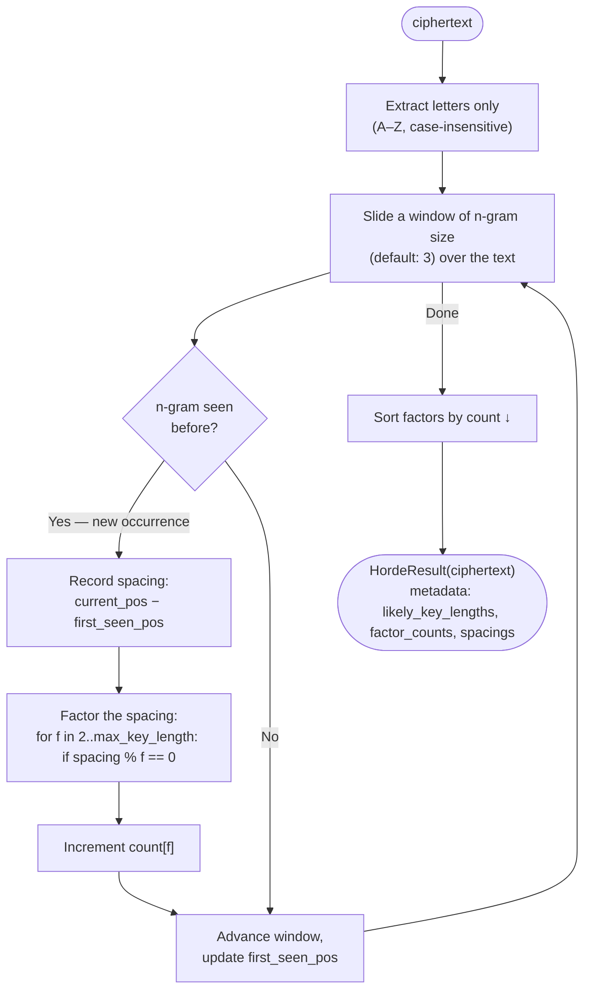

# Kasiski Test

> Find repeated n-grams in a Vigenère ciphertext to estimate the key length from their spacing.

## Overview

The Kasiski test, independently discovered by Charles Babbage (~1846) and Friedrich Kasiski (1863), broke the Vigenère cipher's three-century reputation as unbreakable. The key insight: if the same plaintext fragment happens to align with the same part of the repeating key, it produces identical ciphertext. The distance between these repetitions must be a multiple of the key length.

By finding many such repeated substrings, collecting their spacings, and looking for common factors, we can identify the most likely key length.

**When to use**: as the first step when attacking [Vigenère](../../classical/substitution/vigenere.md). Combine with [Index of Coincidence](../substitution/ioc.md) to confirm. Requires reasonably long ciphertext (200+ letters).

## How It Works



### Why spacings are multiples of the key length

Suppose key = `LEMON` (length 5). If `THE` appears in the plaintext at positions 0 and 15, it aligns with `LEM` and `LEM` again (15 mod 5 = 0). The ciphertext at both positions is identical. The spacing 15 is a multiple of 5.

Not every repeated ciphertext trigram comes from a repeated plaintext trigram aligned with the key — accidental collisions also occur — but across many repetitions, the key length emerges as the most frequent factor.

## API

```python
from hordekit.crypto.attacks.vigenere import kasiski

result = kasiski(ciphertext)
print(result.metadata["likely_key_lengths"])  # [5, 10, 3, 15, 2] — best first
print(result.metadata["factor_counts"])       # {5: 12, 10: 8, 3: 6, ...}
print(result.metadata["spacings"])            # [15, 30, 20, 45, ...]
```

### Signature

```python
def kasiski(
    ciphertext: bytes,
    ngram_size: int = 3,
    max_key_length: int = 20,
) -> HordeResult: ...
```

| Parameter | Type | Description |
|-----------|------|-------------|
| `ciphertext` | `bytes` | Encrypted bytes to analyse |
| `ngram_size` | `int` | Minimum repeated substring length (default: 3). Larger = fewer coincidences but less noise |
| `max_key_length` | `int` | Maximum factor to consider as key length (default: 20) |

### Return value

`HordeResult` wrapping the **original ciphertext unchanged**. `metadata`:

| Key | Type | Description |
|-----|------|-------------|
| `likely_key_lengths` | `list[int]` | Up to 5 candidate key lengths, best first |
| `factor_counts` | `dict[int, int]` | Factor → how many spacings it divides |
| `spacings` | `list[int]` | Raw distances between repeated n-grams |
| `error` | `str` | Set only if analysis failed (text too short, no repeats found) |

## Typical workflow for Vigenère

```python
from hordekit.crypto.attacks.vigenere import kasiski
from hordekit.crypto.attacks.substitution import index_of_coincidence, frequency_analysis

# Step 1: Kasiski test — get candidate key lengths
kas = kasiski(ciphertext)
candidates = kas.metadata["likely_key_lengths"]  # e.g. [5, 10, 15]

# Step 2: IoC — confirm which candidate is correct
ioc = index_of_coincidence(ciphertext)
key_len = ioc.metadata["likely_key_length"]      # e.g. 5

# Step 3: Attack each column as a Caesar cipher
letters = bytes(b for b in ciphertext if chr(b).isalpha())
for i in range(key_len):
    column = bytes(letters[j] for j in range(i, len(letters), key_len))
    col_result = frequency_analysis(column)
    print(f"Column {i}: {col_result.as_str()[:30]}")
```

## Limitations

- Requires **sufficient ciphertext**: short texts have few repeated trigrams and unreliable factor statistics.
- Returns *candidates*, not a guaranteed answer — cross-check with [IoC](../substitution/ioc.md).
- Accidental coincidences add noise — increase `ngram_size` to 4 or 5 to reduce false positives.
- If `error` is set in metadata, the ciphertext is too short for reliable analysis.

## See also

- [Index of Coincidence](../substitution/ioc.md) — independent confirmation of key length
- [Frequency Analysis](../substitution/frequency.md) — per-column attack once key length is confirmed
- [Vigenère Cipher](../../classical/substitution/vigenere.md)

## References

- [Kasiski examination — Wikipedia](https://en.wikipedia.org/wiki/Kasiski_examination)
- [Babbage's cipher-breaking work — Wikipedia](https://en.wikipedia.org/wiki/Charles_Babbage#Cipher-breaking)
- [Practical Cryptography — Kasiski Test](http://practicalcryptography.com/cryptanalysis/text-characterisation/kasiski-test/)
