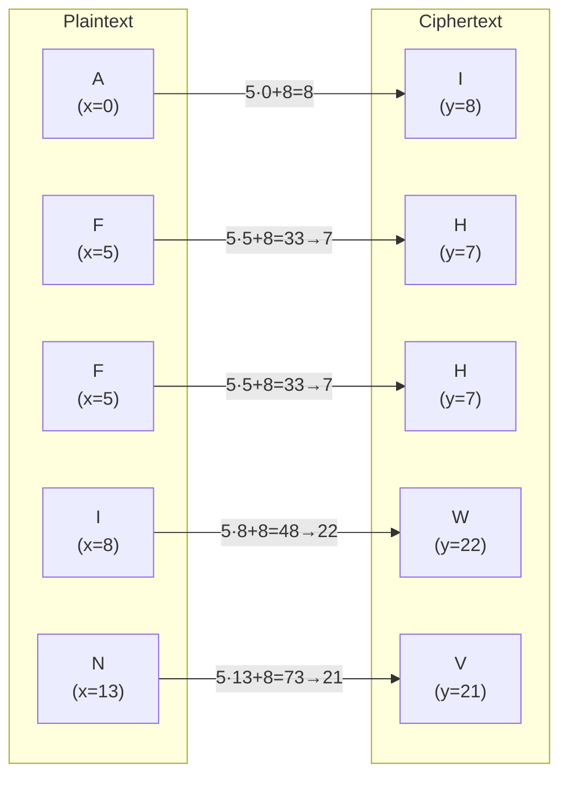
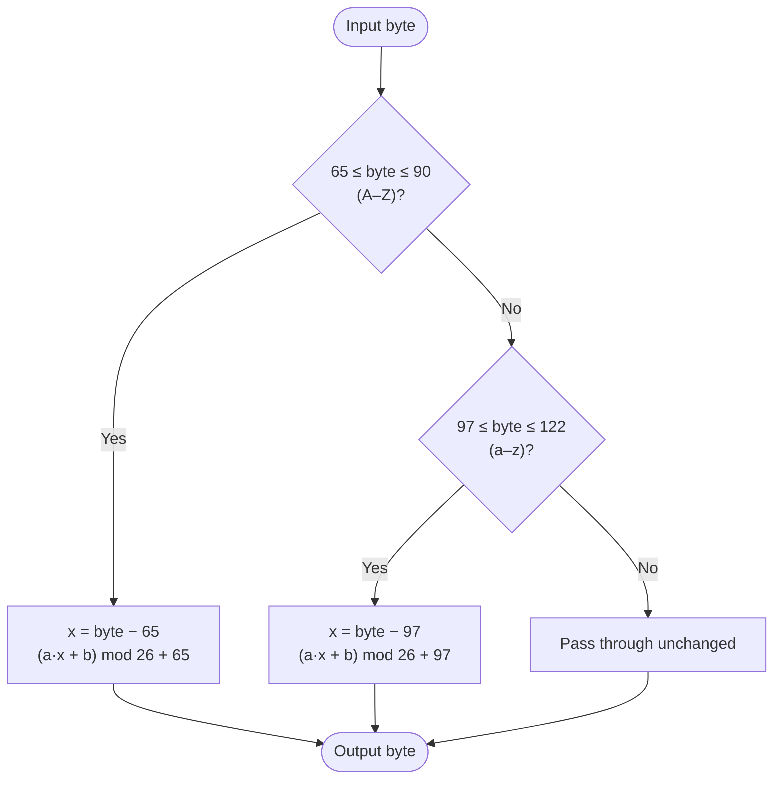

# Affine Cipher

> A monoalphabetic substitution cipher that encrypts each letter using a linear function: `(a·x + b) mod 26`.

## Overview

The Affine cipher generalises the Caesar cipher by using multiplication in addition to addition. Each letter `x` (0–25) is mapped to `(a·x + b) mod 26`. For decryption to be possible, `a` must be coprime with 26, giving 12 valid values of `a` and 26 values of `b` — 312 key combinations in total.

## How It Works

The position of each letter in the alphabet (A=0, B=1, …, Z=25) is transformed by the formula `(a·x + b) mod 26`. Decryption applies the modular inverse: `a⁻¹·(y − b) mod 26`. Case is preserved; non-letter bytes pass through unchanged.

### Letter-by-letter example (a=5, b=8)



### Per-byte algorithm



## API

```python
from hordekit.crypto.classical.substitution import Affine

cipher = Affine(a=5, b=8)
cipher.encrypt(b"AFFINECIPHER")   # -> HordeResult → b"IHHWVCSWFRCP"
cipher.decrypt(b"IHHWVCSWFRCP")   # -> HordeResult → b"AFFINECIPHER"
```

### Parameters

| Parameter | Type | Valid values | Description |
|-----------|------|-------------|-------------|
| `a` | `int` | `1, 3, 5, 7, 9, 11, 15, 17, 19, 21, 23, 25` | Multiplicative key — must be coprime with 26 |
| `b` | `int` | `0–25` | Additive shift |

### Chaining

```python
from hordekit.crypto.classical.substitution import Affine, Caesar

result = (
    Affine(a=7, b=3).encrypt(b"Hello World")
    .pipe(Caesar, shift=5)
    .as_hex()
)
```

## Known Attacks

| Attack | When applicable |
|--------|----------------|
| [Brute force](../../../api/base_classes.md) — `hordekit.crypto.attacks.generic.brute_force` | Always — only 312 possible keys |
| Frequency analysis — `hordekit.crypto.attacks.substitution.frequency` | Ciphertext > ~100 characters |

```python
from hordekit.crypto.attacks.generic import brute_force
from hordekit.crypto.classical.substitution import Affine

result = brute_force(Affine, ciphertext=b"IHHWVCSWFRCP")
print(result.metadata["candidates"][0]["key"])  # {'a': 5, 'b': 8}
```

## References

- [Affine cipher — Wikipedia](https://en.wikipedia.org/wiki/Affine_cipher)
- [Practical Cryptography — Affine Cipher](http://practicalcryptography.com/ciphers/affine-cipher/)
