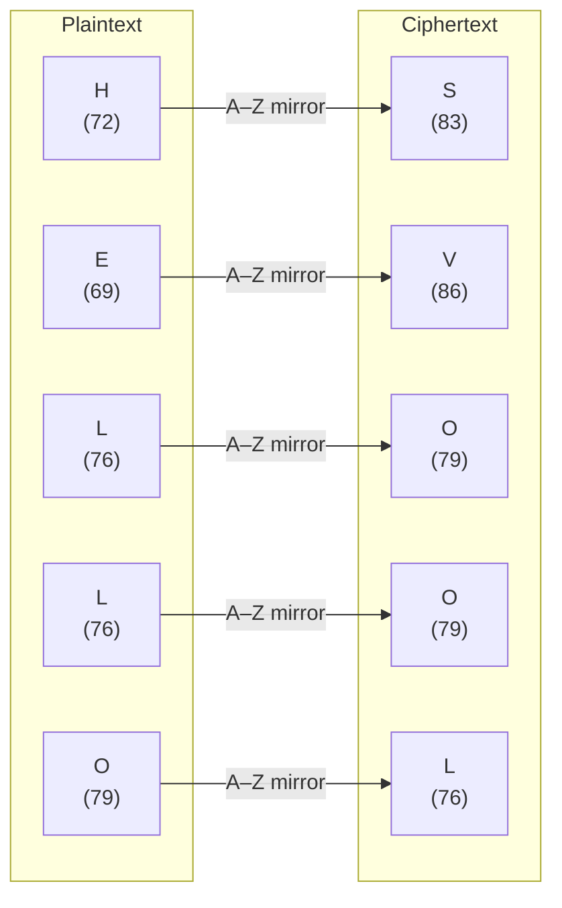
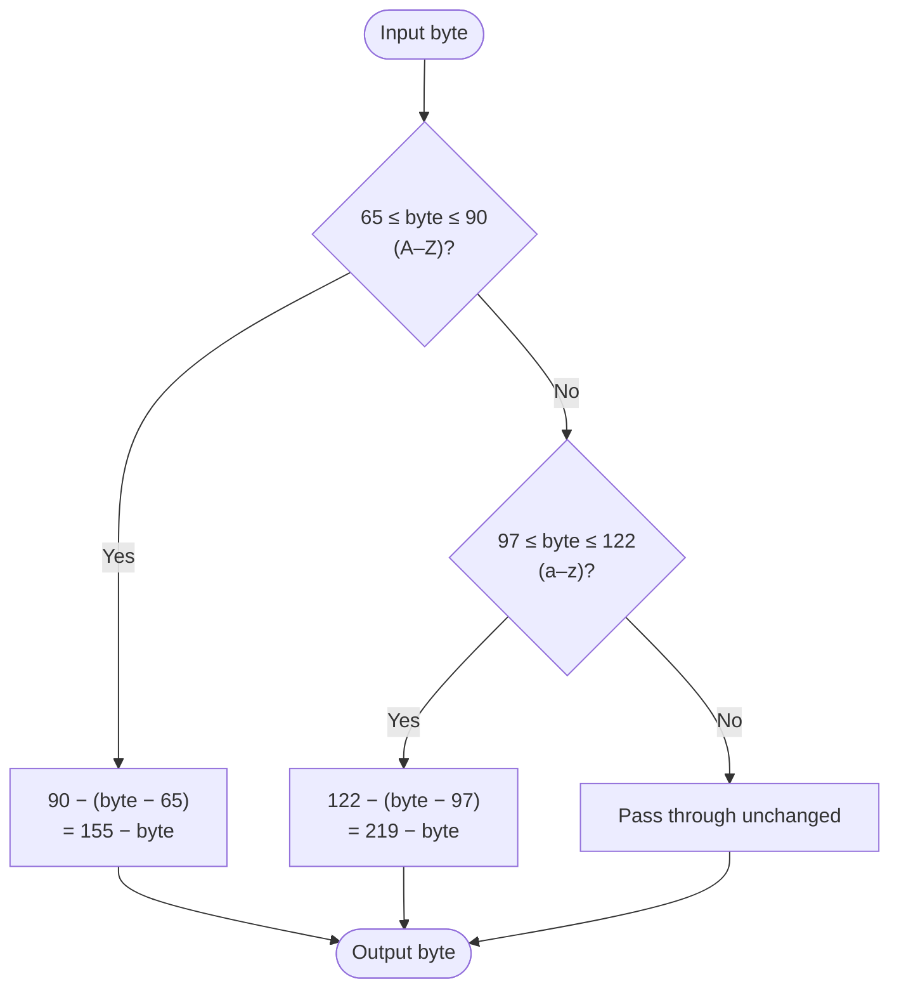

# Atbash

> A substitution cipher that mirrors the alphabet: A↔Z, B↔Y, C↔X, and so on.

## Overview

Atbash is one of the oldest known ciphers, originating in ancient Hebrew cryptography (the name comes from the first, last, second, and second-to-last letters of the Hebrew alphabet). It maps each letter to its mirror position in the alphabet — A becomes Z, B becomes Y, and so forth. The cipher is its own inverse: applying it twice recovers the original text.

## How It Works

Each letter is replaced by the letter at the symmetric position in the alphabet. Uppercase maps to uppercase, lowercase to lowercase. Non-letter bytes pass through unchanged.

### Letter-by-letter example



### Per-byte algorithm



## API

```python
from hordekit.crypto.classical.substitution import Atbash

a = Atbash()
a.encrypt(b"Hello, World!")   # -> HordeResult → b"Svool, Dliow!"
a.decrypt(b"Svool, Dliow!")   # -> HordeResult → b"Hello, World!"

# self-inverse
a.encrypt(a.encrypt(b"Hello")) == b"Hello"  # True
```

### Chaining

```python
from hordekit.crypto.classical.substitution import Atbash, Caesar

result = (
    Atbash().encrypt(b"HELLO")
    .pipe(Caesar, shift=3)
    .as_str()
)
```

## Known Attacks

| Attack | When applicable |
|--------|----------------|
| Trivial — apply Atbash again | Always; there is exactly one key |
| Frequency analysis | Ciphertext > ~100 characters |

## References

- [Atbash — Wikipedia](https://en.wikipedia.org/wiki/Atbash)
