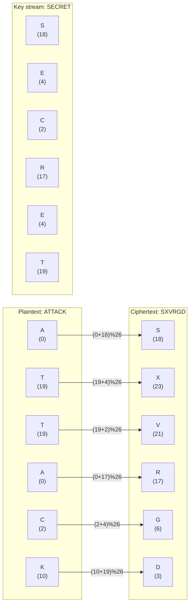
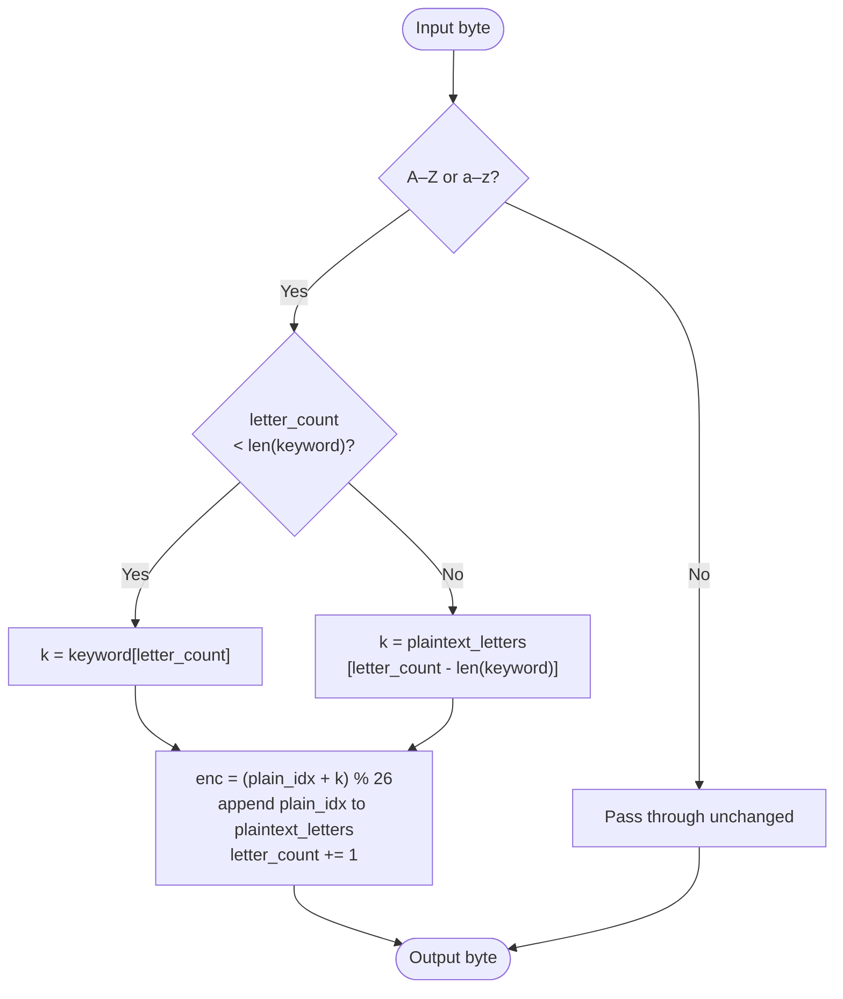

# Autokey Cipher

> A polyalphabetic substitution cipher that extends the keyword with the plaintext itself, eliminating periodic key repetition.

## Overview

The Autokey cipher was invented by Blaise de Vigenère in 1586 and improved by Giovan Battista Bellaso. Unlike the Vigenère cipher — which repeats a fixed keyword — Autokey seeds the key with the keyword and then continues with the plaintext letters. This removes the periodic structure that makes Vigenère vulnerable to Kasiski analysis, though it introduces a different statistical weakness: the key and the plaintext share the same letter distribution.

## How It Works

Encryption starts with the keyword. Once the keyword is exhausted, the plaintext letters that have already been encrypted are appended to the key stream. Each plaintext letter is shifted forward by the corresponding key letter (A=0 … Z=25), modulo 26. Decryption works the same way: use the keyword first, then append each recovered plaintext letter to the key as it is revealed.



### Algorithm



## API

```python
from hordekit.crypto.classical.substitution import Autokey

cipher = Autokey(b"SECRET")
cipher.encrypt(b"ATTACKATDAWN")   # -> HordeResult(b"SXVRGDAMWAYX")
cipher.decrypt(b"SXVRGDAMWAYX")  # -> HordeResult(b"ATTACKATDAWN")
```

### Parameters

| Parameter | Type    | Description                                         |
|-----------|---------|-----------------------------------------------------|
| `key`     | `bytes` | Keyword — ASCII letters only (case-insensitive), non-empty |

### Chaining

```python
from hordekit.crypto.classical.substitution import Autokey, Caesar

result = (
    Autokey(b"SECRET").encrypt(b"ATTACKATDAWN")
    .pipe(Caesar, shift=3)
    .as_hex()
)
```

## Known Attacks

| Attack | When applicable |
|--------|----------------|
| [Frequency Analysis](../../attacks/substitution/frequency.md) | The key stream shares the plaintext's letter distribution; overlapping correlations leak information for longer texts |
| [Index of Coincidence](../../attacks/substitution/ioc.md) | Detects that the cipher is polyalphabetic; IoC will be lower than a monoalphabetic cipher but not as flat as true random |
| [Dictionary Attack](../../attacks/generic/dictionary.md) | When the keyword is a common word — enumerate candidate keywords and test decryption quality |

> **Note:** Kasiski analysis does **not** apply because the Autokey key stream never repeats periodically.

## References

- [Wikipedia — Autokey cipher](https://en.wikipedia.org/wiki/Autokey_cipher)
- Sinkov, A. *Elementary Cryptanalysis*, Mathematical Association of America, 1966.
