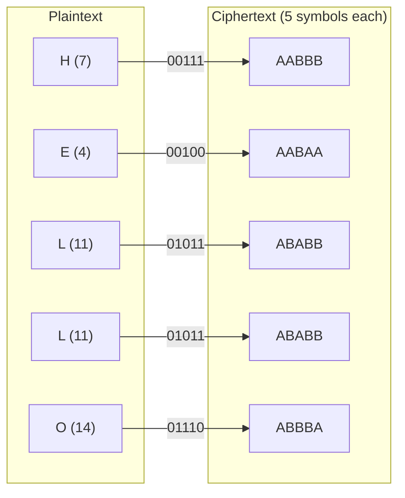
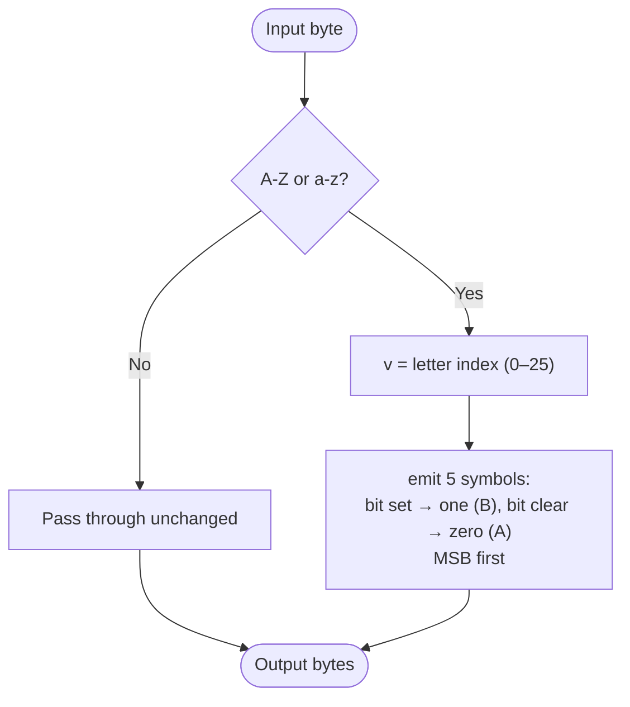

# Baconian Cipher

> A binary encoding that replaces each letter with a group of five symbols drawn from two characters (A/B), originally designed to be hidden inside a carrier text.

## Overview

The Baconian cipher was devised by Sir Francis Bacon around 1605. It is really a *steganographic* encoding: every letter becomes a five-symbol group of two distinct characters (here `A` and `B`), which Bacon hid inside an innocuous message by using two different typefaces. This implementation uses the modern, unambiguous **26-letter** mapping, in which a letter's code is simply its alphabet index written MSB-first in 5-bit binary — so it round-trips perfectly, unlike Bacon's original 24-letter table that merged I/J and U/V.

## How It Works

Each plaintext letter is converted to its 0-based alphabet index (A=0 … Z=25) and written as five binary digits, most-significant first. Each `0` bit is emitted as the *zero* symbol (`A` by default) and each `1` bit as the *one* symbol (`B`). Five output symbols are produced per input letter; case is discarded and non-letter bytes pass through unchanged. Decryption groups the code symbols back into fives and reverses the binary conversion, ignoring (and passing through) any character that is not a code symbol.

### Letter-by-letter example (`HELLO`)



### Per-byte algorithm



## API

```python
from hordekit.crypto.classical.substitution import Baconian

cipher = Baconian()

cipher.encrypt(b"HELLO")  # -> HordeResult(b"AABBBAABAAABABBABABBABBBA")
cipher.decrypt(b"AABBBAABAAABABBABABBABBBA")  # -> HordeResult(b"HELLO")

# Non-letter bytes pass through unchanged
cipher.encrypt(b"A!12")  # -> HordeResult(b"AAAAA!12")

# Choose different code symbols (e.g. for a 0/1 carrier)
Baconian(zero=b"0", one=b"1").encrypt(b"Z")  # -> HordeResult(b"11001")
```

### Parameters

| Parameter | Type    | Description                                                       |
|-----------|---------|-------------------------------------------------------------------|
| `zero`    | `bytes` | Single byte used for a `0` bit (default `b"A"`)                    |
| `one`     | `bytes` | Single byte used for a `1` bit (default `b"B"`); must differ from `zero` |

### Chaining

```python
from hordekit.crypto.classical.substitution import Baconian, Caesar

result = (
    Caesar(shift=3).encrypt(b"ATTACK")
    .pipe(Baconian)
    .as_str()
)
```

## Known Attacks

| Attack | When applicable |
|--------|----------------|
| [Frequency Analysis](../../attacks/substitution/frequency.md) | Not directly — the output has only two symbols; analysis is done *after* decoding the groups back to letters |
| [Dictionary Attack](../../attacks/generic/dictionary.md) | Of limited use — there is no key, only the decode step itself |

> **Note:** Baconian has **no key** — recovering the plaintext is purely a matter of *recognising* the encoding (text built from two repeating symbols in groups of five) and running the decode. There is nothing to brute force. Its real security came from steganography: hiding the two symbols inside an ordinary-looking carrier text (e.g. two fonts). Once the binary structure is spotted, decoding is immediate.

## References

- [Wikipedia — Bacon's cipher](https://en.wikipedia.org/wiki/Bacon%27s_cipher)
- Bacon, F. *De Augmentis Scientiarum*, 1623.
- Kahn, D. *The Codebreakers*, Scribner, 1996.
