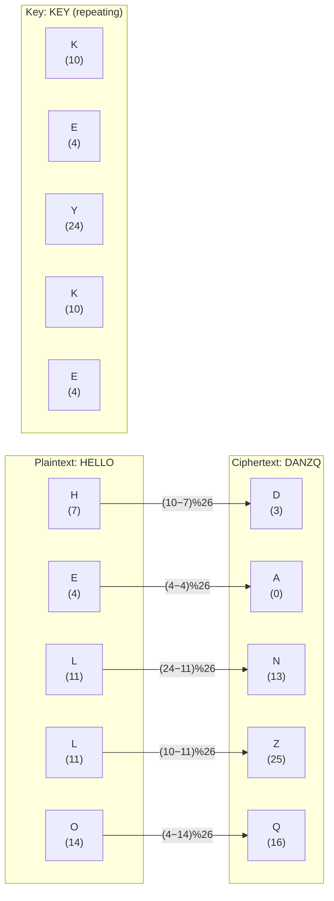
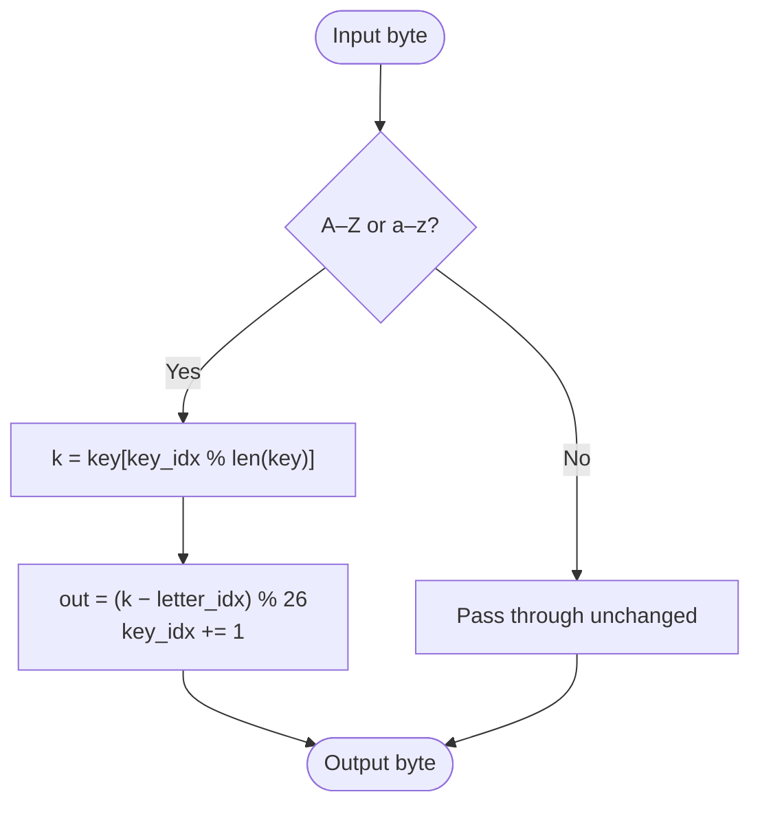

# Beaufort Cipher

> A reciprocal polyalphabetic substitution cipher where encryption and decryption are identical operations.

## Overview

The Beaufort cipher was invented by Sir Francis Beaufort (1774–1857), a British admiral best known for the Beaufort wind scale. It is closely related to the Vigenère cipher but uses subtraction rather than addition, making it a **reciprocal** cipher — the same algorithm encrypts and decrypts. Beaufort was used in practice during the early 20th century and shares the same periodic-key structure as Vigenère.

## How It Works

Each plaintext letter is transformed by subtracting its index (A=0 … Z=25) from the corresponding key letter's index, modulo 26. Because the formula is symmetric — `C = (K − P) mod 26` implies `P = (K − C) mod 26` — encryption and decryption are the same operation. Non-alphabetic characters pass through unchanged, and the key position only advances on alphabetic input.



### Algorithm



## API

```python
from hordekit.crypto.classical.substitution import Beaufort

cipher = Beaufort(b"KEY")
cipher.encrypt(b"HELLO")   # -> HordeResult(b"DANZQ")
cipher.decrypt(b"DANZQ")   # -> HordeResult(b"HELLO")

# Because it is reciprocal, these are equivalent:
cipher.encrypt(b"DANZQ")   # -> HordeResult(b"HELLO")
```

### Parameters

| Parameter | Type    | Description                                                   |
|-----------|---------|---------------------------------------------------------------|
| `key`     | `bytes` | Keyword — ASCII letters only (case-insensitive), non-empty    |

### Chaining

```python
from hordekit.crypto.classical.substitution import Beaufort, Caesar

result = (
    Beaufort(b"KEY").encrypt(b"HELLO WORLD")
    .pipe(Caesar, shift=3)
    .as_hex()
)
```

## Known Attacks

| Attack | When applicable |
|--------|----------------|
| [Frequency Analysis](../../attacks/substitution/frequency.md) | Ciphertext > ~100 characters — periodic key produces predictable frequency patterns per key position |
| [Index of Coincidence](../../attacks/substitution/ioc.md) | Detects polyalphabetic cipher and estimates key length; IoC per column reveals monoalphabetic structure |
| [Kasiski Test](../../attacks/vigenere/kasiski.md) | Key length estimation via repeated trigram distances — identical approach to Vigenère |
| [Brute Force](../../attacks/generic/brute_force.md) | Only practical for very short keys; keyspace grows as 26^n |
| [Dictionary Attack](../../attacks/generic/dictionary.md) | When the keyword is a common word |

> **Note:** Once the key length is known (via Kasiski or IoC), each column is a shifted alphabet and can be broken with frequency analysis exactly like a Caesar cipher.

## References

- [Wikipedia — Beaufort cipher](https://en.wikipedia.org/wiki/Beaufort_cipher)
- Sinkov, A. *Elementary Cryptanalysis*, Mathematical Association of America, 1966.
- Kahn, D. *The Codebreakers*, Scribner, 1996.
