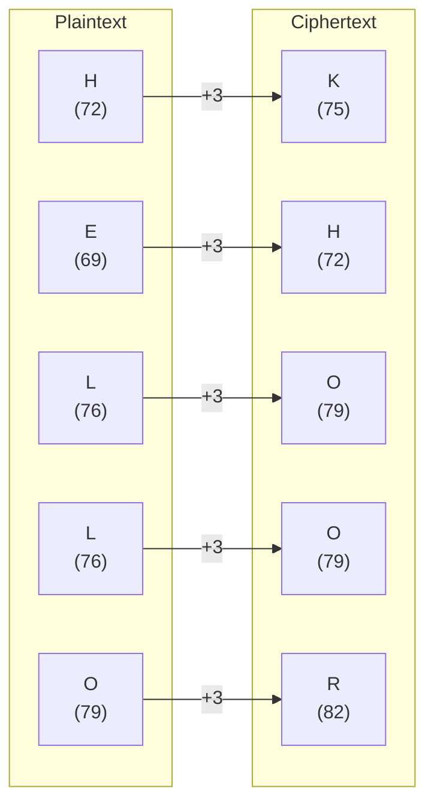
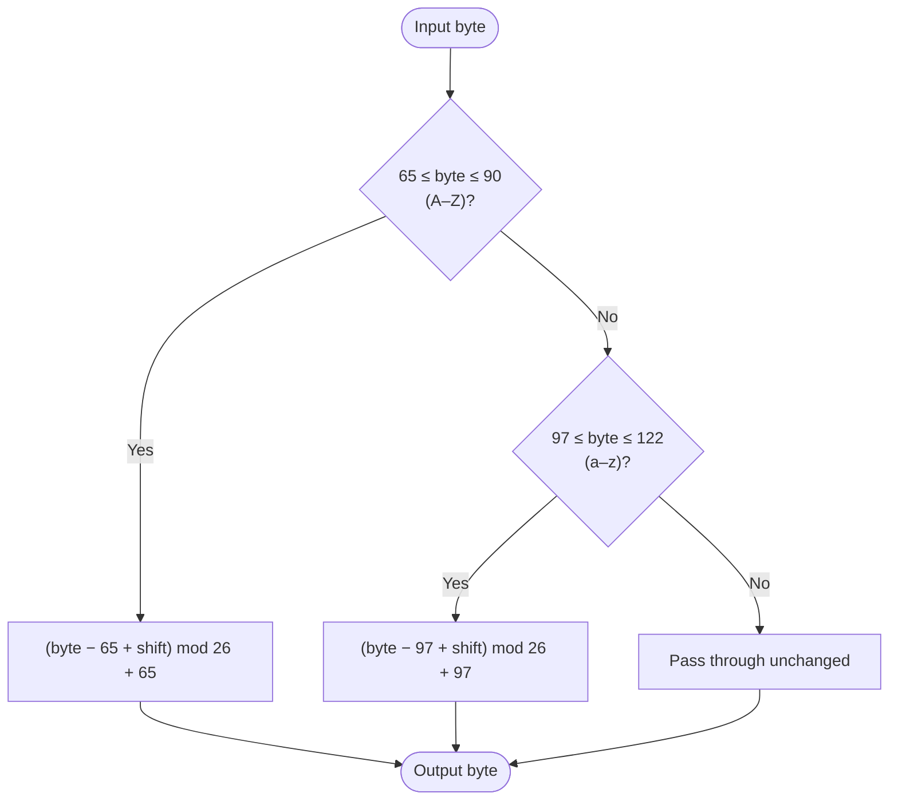

# Caesar Cipher

> A monoalphabetic substitution cipher that shifts each letter a fixed number of positions in the alphabet.

## Overview

The Caesar cipher is one of the oldest and simplest encryption techniques, attributed to Julius Caesar who reportedly used it with a shift of 3 to protect military communications. It is a monoalphabetic substitution cipher: every occurrence of a given letter maps to the same ciphertext letter, making it trivially vulnerable to frequency analysis. Despite its weakness, it forms the basis for more complex ciphers such as ROT13 and Vigenère.

## How It Works

Each letter in the plaintext is replaced by the letter a fixed number of positions further along in the alphabet. The alphabet wraps around — shifting `Z` by 1 gives `A`. Non-letter bytes (digits, spaces, punctuation) are passed through unchanged, and letter case is preserved.

### Letter-by-letter example (shift = 3)



### Per-byte algorithm



## API

```python
from hordekit.crypto.classical.substitution import Caesar

cipher = Caesar(shift=3)
cipher.encrypt(b"Hello, World!")   # -> HordeResult → b"Khoor, Zruog!"
cipher.decrypt(b"Khoor, Zruog!")   # -> HordeResult → b"Hello, World!"
```

### Parameters

| Parameter | Type | Range | Description |
|-----------|------|-------|-------------|
| `shift` | `int` | 1–25 | Number of positions to shift each letter. Values are taken mod 26. |

### Chaining

```python
from hordekit.crypto.classical.substitution import Caesar, ROT13

result = (
    Caesar(shift=3).encrypt(b"Hello")
    .pipe(ROT13)          # apply ROT13 on top
    .as_base64()
)
```

## Known Attacks

| Attack | When applicable |
|--------|----------------|
| [Brute Force](../../attacks/generic/brute_force.md) | Always — only 25 possible keys |
| [Frequency Analysis](../../attacks/substitution/frequency.md) | Ciphertext > ~100 characters |

```python
from hordekit.crypto.attacks.generic import brute_force
from hordekit.crypto.classical.substitution import Caesar

result = brute_force(Caesar, b"Khoor Zruog")
print(result.as_str())                       # best candidate
print(result.metadata["candidates"][0])      # {"key": {"shift": 3}, "score": ..., "result": ...}
```

## References

- [Caesar cipher — Wikipedia](https://en.wikipedia.org/wiki/Caesar_cipher)
- [Practical Cryptography — Caesar Cipher](http://practicalcryptography.com/ciphers/caesar-cipher/)
