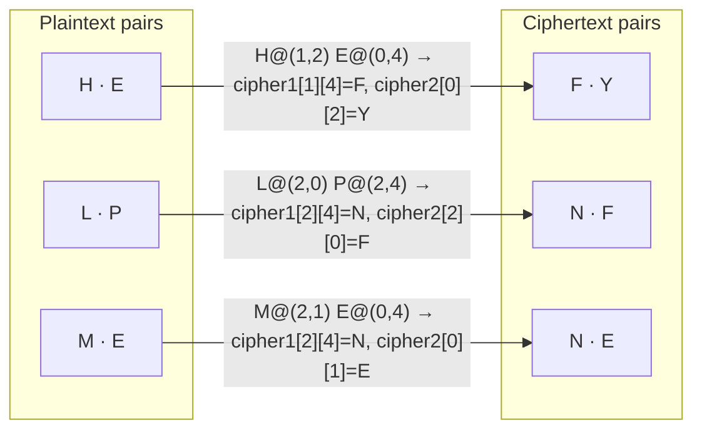
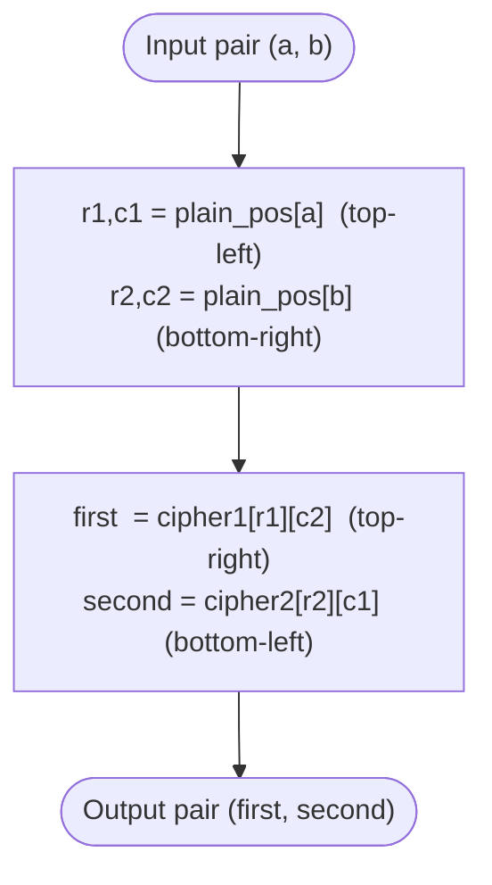

# Four-square Cipher

> A digraph substitution cipher that encrypts letter pairs using four 5×5 squares — two plaintext and two keyed ciphertext — where I and J share a cell.

## Overview

The Four-square cipher was invented by the French cryptographer Félix Delastelle (1840–1902), who also devised the Bifid and Trifid ciphers. Like Playfair it encrypts *digraphs* (letter pairs) rather than single letters, defeating simple monogram frequency analysis. It is generally considered stronger than Playfair: because the two ciphertext squares are independently keyed and the plaintext letters are looked up in separate squares, a digraph of two identical letters needs no filler and there are no symmetric pair relationships to exploit.

## How It Works

Four 5×5 squares are arranged in a larger square. The **top-left** and **bottom-right** squares hold the plain alphabet (deduplicated, J treated as I). The **top-right** square is keyed with `key1` and the **bottom-left** with `key2` — these are the ciphertext squares. To encrypt a pair, the first letter is located in the top-left square and the second in the bottom-right square. These two positions define a rectangle; the encrypted pair is read from the *other* two corners — the top-right square (row of the first letter, column of the second) and the bottom-left square (row of the second letter, column of the first). Odd-length input is padded with a trailing X.

### The four squares (key1: `EXAMPLE`, key2: `KEYWORD`)

```
A B C D E   |  E X A M P
F G H I K   |  L B C D F
L M N O P   |  G H I K N      top-left  = plain
Q R S T U   |  O Q R S T      top-right = key1
V W X Y Z   |  U V W Y Z
------------+------------
K E Y W O   |  A B C D E
R D A B C   |  F G H I K
F G H I L   |  L M N O P      bottom-left  = key2
M N P Q S   |  Q R S T U      bottom-right = plain
T U V X Z   |  V W X Y Z
```

### Digraph encryption example (`HELPME`)



### Pair encryption algorithm



Decryption mirrors the process: the first ciphertext letter is found in the top-right square and the second in the bottom-left square, then the plaintext pair is read from the two plaintext squares.

## API

```python
from hordekit.crypto.classical.substitution import FourSquare

cipher = FourSquare(b"EXAMPLE", b"KEYWORD")

# Encrypt — odd-length input is padded with X
cipher.encrypt(b"HELPME")  # -> HordeResult(b"FYNFNE")

# Decrypt
cipher.decrypt(b"FYNFNE")  # -> HordeResult(b"HELPME")

# Non-alpha bytes pass through unchanged and preserve their relative position
cipher.encrypt(b"HE LP")  # -> HordeResult(b"FY NF")
```

### Parameters

| Parameter | Type    | Description                                                                                  |
|-----------|---------|----------------------------------------------------------------------------------------------|
| `key1`    | `bytes` | Keyword for the top-right ciphertext square — ASCII letters only (non-letters ignored, J=I), non-empty |
| `key2`    | `bytes` | Keyword for the bottom-left ciphertext square — same rules as `key1`                          |

### Chaining

```python
from hordekit.crypto.classical.substitution import FourSquare, Caesar

result = (
    FourSquare(b"SECRET", b"KEYWORD").encrypt(b"ATTACKATDAWN")
    .pipe(Caesar, shift=3)
    .as_hex()
)
```

## Known Attacks

| Attack | When applicable |
|--------|----------------|
| [Dictionary Attack](../../attacks/generic/dictionary.md) | When both keywords are common English words |
| [Frequency Analysis](../../attacks/substitution/frequency.md) | Digraph frequency analysis (not monogram) — effective with several hundred characters; the 600 possible digraphs have non-uniform frequency |
| [Index of Coincidence](../../attacks/substitution/ioc.md) | Can confirm digraphic structure and distinguish from monoalphabetic ciphers |

> **Note:** Four-square is **not** brute-forceable — the keyspace is two independently mixed 5×5 squares, far too large to enumerate. It is generally harder to break than Playfair: there is no doubled-letter filler to leak structure, and the two ciphertext squares are keyed independently. The standard attack remains manual digraph frequency analysis once enough ciphertext is available.

## References

- [Wikipedia — Four-square cipher](https://en.wikipedia.org/wiki/Four-square_cipher)
- Delastelle, F. *Traité élémentaire de cryptographie*, 1902.
- Bauer, F. *Decrypted Secrets*, Springer, 2007.
