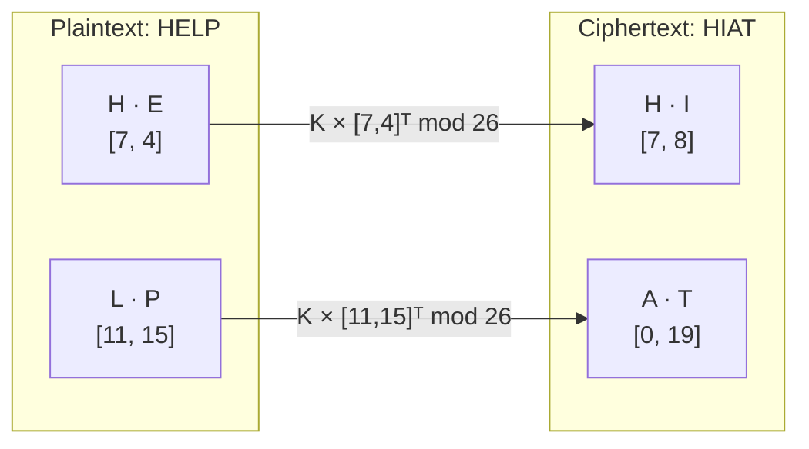
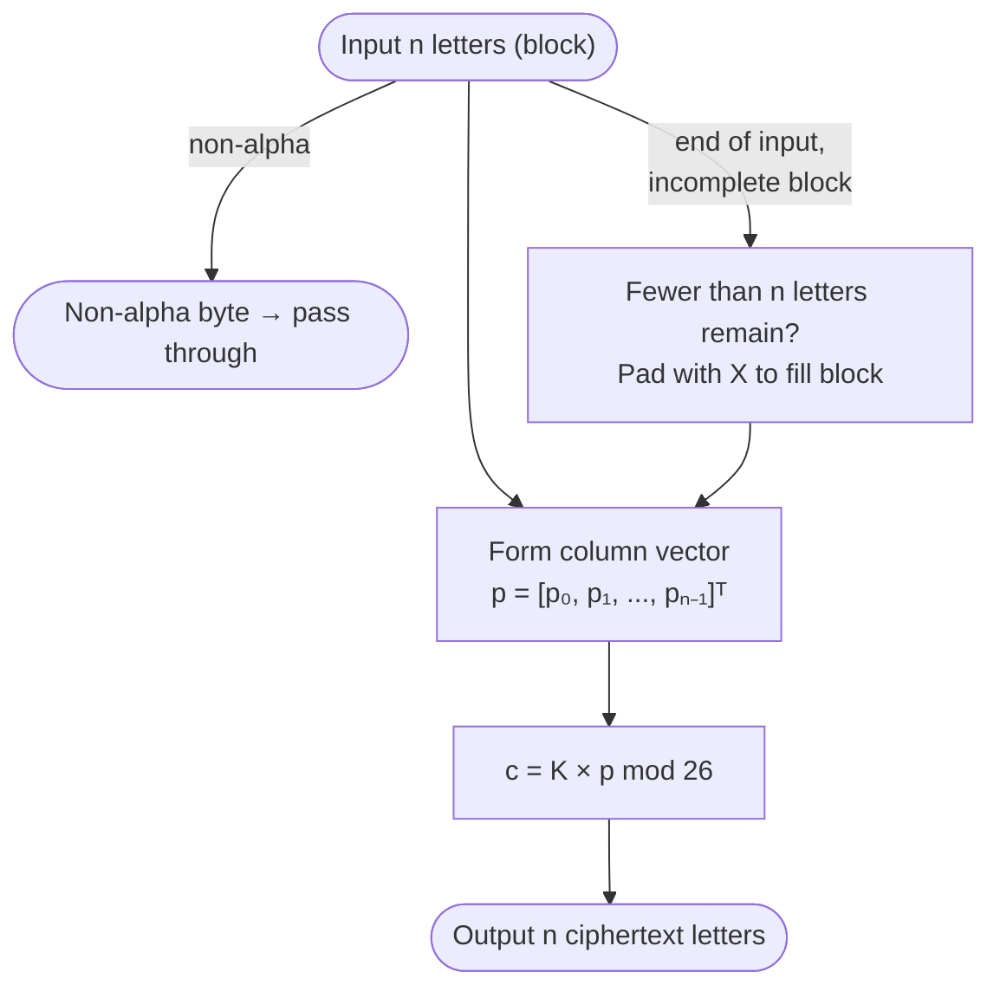

# Hill Cipher

> A polygraphic substitution cipher that encrypts blocks of n letters at once using matrix multiplication mod 26.

## Overview

The Hill cipher was invented by Lester S. Hill in 1929 and published in *The American Mathematical Monthly*. It was the first practical polygraphic cipher — encrypting multiple letters simultaneously — which hides single-letter frequency patterns entirely. The key is an invertible n×n matrix over Z/26Z. While historically significant, Hill is broken by a straightforward known-plaintext attack: n² letter pairs suffice to recover the full key matrix by solving a system of linear equations.

## How It Works

Plaintext is split into blocks of n letters. Each block is treated as a column vector and multiplied by the key matrix mod 26 to produce a ciphertext block. Non-alphabetic characters pass through unchanged. If the last block has fewer than n letters it is padded with `X`. Decryption uses the modular inverse of the key matrix.

$$
\mathbf{c} = K \cdot \mathbf{p} \pmod{26}
\qquad
\mathbf{p} = K^{-1} \cdot \mathbf{c} \pmod{26}
$$

### Example — 2×2 key, plaintext `HELP`

Key matrix and its inverse:

$$
K = \begin{pmatrix} 3 & 3 \\ 2 & 5 \end{pmatrix}
\qquad
K^{-1} = \begin{pmatrix} 15 & 17 \\ 20 & 9 \end{pmatrix} \pmod{26}
$$



Step-by-step for block `HE`:

$$
K \cdot \begin{pmatrix} 7 \\ 4 \end{pmatrix}
= \begin{pmatrix} 3 \cdot 7 + 3 \cdot 4 \\ 2 \cdot 7 + 5 \cdot 4 \end{pmatrix}
= \begin{pmatrix} 33 \\ 34 \end{pmatrix}
\equiv \begin{pmatrix} 7 \\ 8 \end{pmatrix} \pmod{26}
= \text{H, I}
$$

### Algorithm



## API

```python
from hordekit.crypto.classical.substitution import Hill

# 2×2 key
cipher = Hill(key=[[3, 3], [2, 5]])
cipher.encrypt(b"HELP")   # -> HordeResult(b"HIAT")
cipher.decrypt(b"HIAT")   # -> HordeResult(b"HELP")

# 3×3 key (Wikipedia example)
cipher3 = Hill(key=[[6, 24, 1], [13, 16, 10], [20, 17, 15]])
cipher3.encrypt(b"ACT")   # -> HordeResult(b"POH")
```

### Parameters

| Parameter | Type              | Description                                                                              |
|-----------|-------------------|------------------------------------------------------------------------------------------|
| `key`     | `list[list[int]]` | Square n×n matrix; entries in [0, 25]; must be invertible mod 26 (det coprime to 26)    |

### Chaining

```python
from hordekit.crypto.classical.substitution import Hill, Caesar

result = (
    Hill([[3, 3], [2, 5]]).encrypt(b"HELLOWORLD")
    .pipe(Caesar, shift=7)
    .as_hex()
)
```

## Known Attacks

| Attack | When applicable |
|--------|----------------|
| [Known-Plaintext Attack](../../../attacks/hill/known_plaintext.md) | n² letter pairs suffice to recover the full key matrix |
| [Dictionary Attack](../../attacks/generic/dictionary.md) | When the key is derived from a short keyword |
| [Frequency Analysis](../../attacks/substitution/frequency.md) | Not directly applicable — polygraphic structure hides monogram frequencies |

> **Note:** Hill is completely broken under **known-plaintext** conditions regardless of matrix size. Frequency analysis on n-grams (n-graph frequencies) can also recover the key without any known plaintext when enough ciphertext is available (~several hundred letters for 2×2, more for larger n).

## References

- [Wikipedia — Hill cipher](https://en.wikipedia.org/wiki/Hill_cipher)
- Hill, L. S. "Cryptography in an Algebraic Alphabet." *The American Mathematical Monthly* 36 (1929): 306–312.
- Stinson, D. *Cryptography: Theory and Practice*, CRC Press, 2006.
