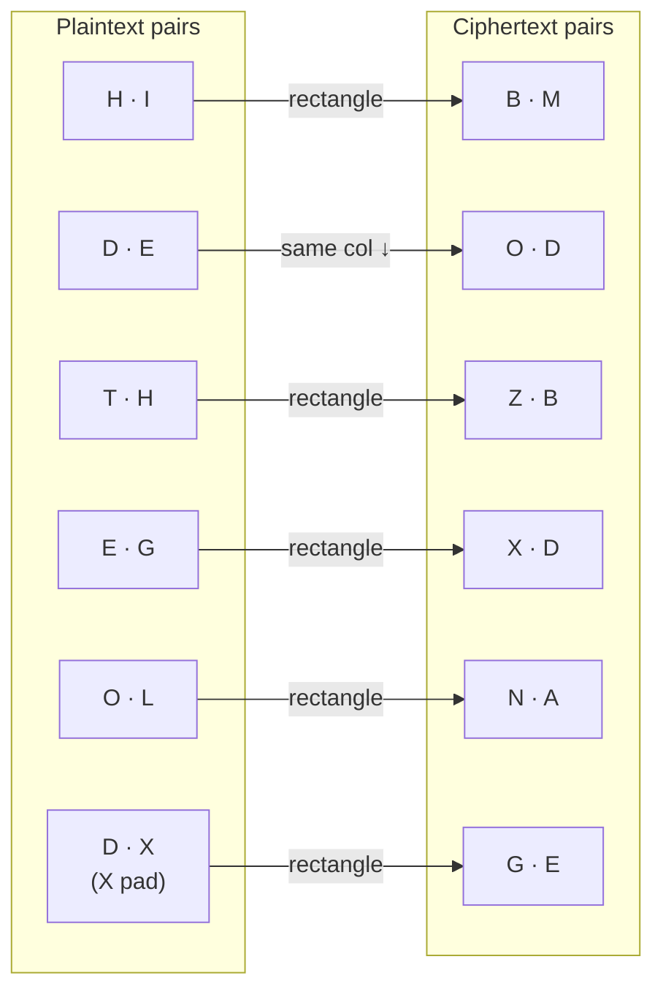
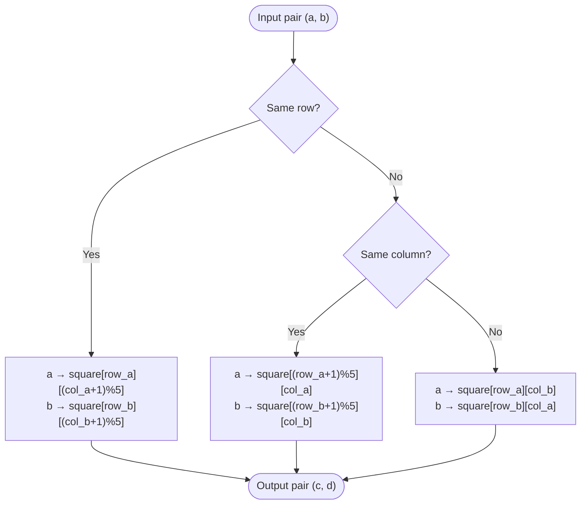

# Playfair Cipher

> A digraph substitution cipher that encrypts pairs of letters using a 5×5 key square, where I and J share a cell.

## Overview

The Playfair cipher was invented by Charles Wheatstone in 1854 and popularised by Lyon Playfair, after whom it is named. It was used operationally by British forces in the Boer War and World War I. Unlike monoalphabetic ciphers, Playfair encrypts letter *pairs* (digraphs), which eliminates simple single-letter frequency analysis and makes 600 digraph frequencies much harder to exploit than 26 letter frequencies.

## How It Works

A 5×5 key square is constructed by filling it with the key letters (deduplicated, J treated as I) followed by the remaining alphabet. Plaintext is split into letter pairs; if both letters in a pair are identical, an X (or Q) is inserted between them, and a trailing X is added to odd-length inputs. Each pair is encrypted by three rules based on the letters' positions in the square: same row shifts right, same column shifts down, and otherwise each letter moves to the other's column within its own row.

### Key square (key: `PLAYFAIR EXAMPLE`)

```
P  L  A  Y  F
I  R  E  X  M
B  C  D  G  H
K  N  O  Q  S
T  U  V  W  Z
```

### Digraph encryption example (`HIDETHEGOLD`)



### Pair encryption algorithm



Decryption reverses the row and column shifts (shift left / shift up); the rectangle rule is identical in both directions.

## API

```python
from hordekit.crypto.classical.substitution import Playfair

cipher = Playfair(b"PLAYFAIR EXAMPLE")

# Encrypt — odd-length input is padded with X
cipher.encrypt(b"HIDETHEGOLD")  # -> HordeResult(b"BMODZB XDNAGE" without space)

# Decrypt — padded X remains in output
cipher.decrypt(b"BMODBZXDNAGE")  # -> HordeResult(b"HIDETHEGOLDX")

# Non-alpha bytes pass through unchanged and preserve their relative position
cipher.encrypt(b"HI DE")  # -> HordeResult(b"BM OD")
```

### Parameters

| Parameter | Type    | Description                                                                            |
|-----------|---------|----------------------------------------------------------------------------------------|
| `key`     | `bytes` | Keyword — ASCII letters only (non-letters silently ignored, J treated as I), non-empty |

### Chaining

```python
from hordekit.crypto.classical.substitution import Playfair, Caesar

result = (
    Playfair(b"SECRET").encrypt(b"ATTACKATDAWN")
    .pipe(Caesar, shift=3)
    .as_hex()
)
```

## Known Attacks

| Attack | When applicable |
|--------|----------------|
| [Dictionary Attack](../../attacks/generic/dictionary.md) | When the keyword is a common English word |
| [Frequency Analysis](../../attacks/substitution/frequency.md) | Digraph frequency analysis (not monogram) — effective with ~500+ characters; 600 possible digraphs have non-uniform frequency |
| [Index of Coincidence](../../attacks/substitution/ioc.md) | Can confirm digraphic structure and distinguish from monoalphabetic ciphers |

> **Note:** Playfair is **not** brute-forceable — the keyspace is the set of all distinct 5×5 arrangements, far too large to enumerate. The standard attack is manual digraph frequency analysis: common English digraphs (TH, HE, IN, ER…) map to the most frequent ciphertext digraphs, allowing progressive key reconstruction.

## References

- [Wikipedia — Playfair cipher](https://en.wikipedia.org/wiki/Playfair_cipher)
- Bauer, F. *Decrypted Secrets*, Springer, 2007.
- Kahn, D. *The Codebreakers*, Scribner, 1996.
