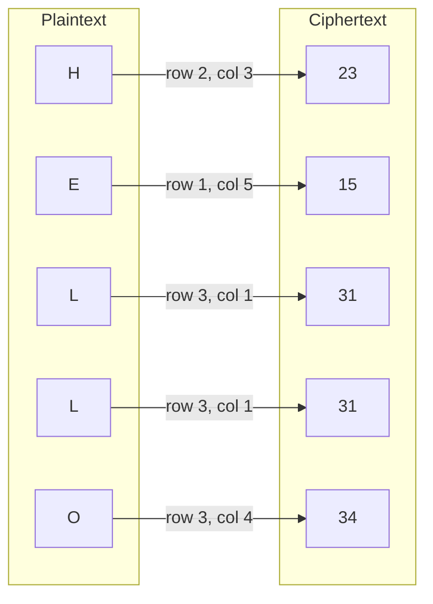
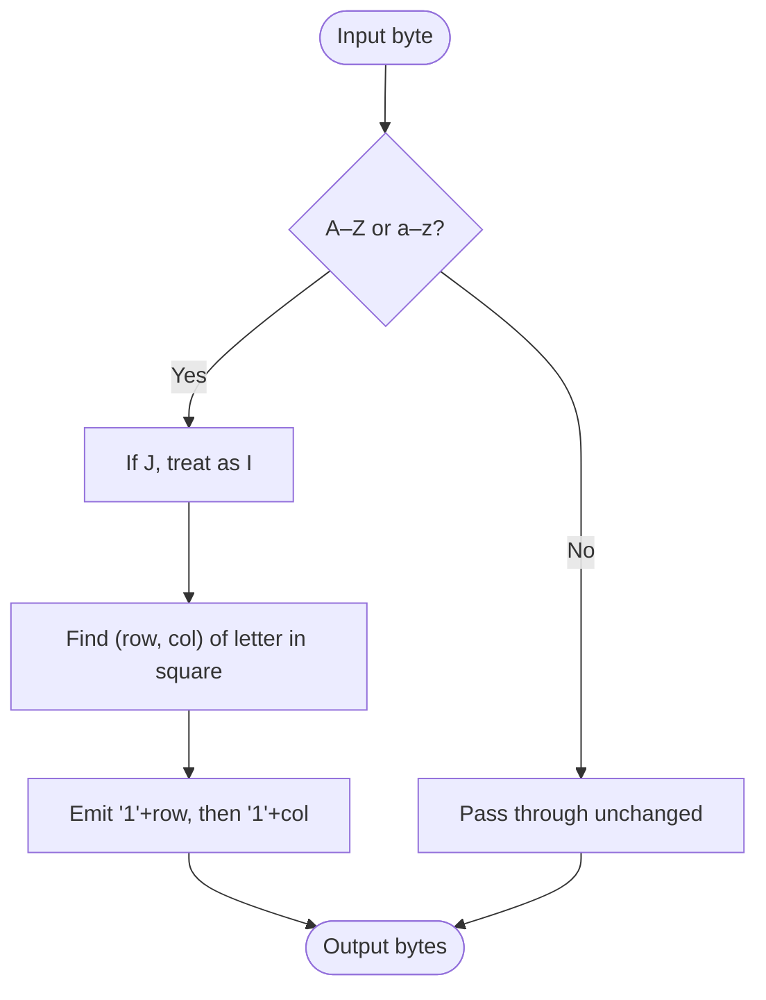

# Polybius Square Cipher

> A substitution cipher that maps each letter to a two-digit coordinate pair read off a 5×5 grid, where I and J share a cell.

## Overview

The Polybius square was described by the Greek historian Polybius (c. 200–118 BC) as a way to transmit letters as pairs of numbers, for example via two groups of torches. Because each letter becomes two digits in the range 1–5, it is a *fractionating* encoding that underpins several later ciphers (Nihilist, Bifid, Trifid, ADFGVX). On its own it is a simple monoalphabetic substitution: every letter always maps to the same coordinate pair.

## How It Works

A 5×5 grid is filled with the alphabet, merging I and J into one cell so that 25 letters fit. An optional keyword can scramble the grid (the deduplicated keyword letters come first, then the remaining alphabet), producing a *mixed* Polybius square. Each plaintext letter is replaced by its 1-indexed row digit followed by its column digit; decryption reads the digits back in pairs and looks up the corresponding cell.

### Standard square (no key)

```
   1  2  3  4  5
1  A  B  C  D  E
2  F  G  H  I  K     (J shares I's cell)
3  L  M  N  O  P
4  Q  R  S  T  U
5  V  W  X  Y  Z
```

### Letter-by-letter example (`HELLO`)



### Per-byte algorithm



Decryption reverses the process: each consecutive pair of digits 1–5 is treated as `(row, col)` and replaced by the corresponding letter (always uppercase, since case is not preserved). Non-digit bytes pass through unchanged.

## API

```python
from hordekit.crypto.classical.substitution import Polybius

# Standard square
cipher = Polybius()
cipher.encrypt(b"HELLO")        # -> HordeResult(b"2315313134")
cipher.decrypt(b"2315313134")   # -> HordeResult(b"HELLO")

# Mixed square from a keyword
keyed = Polybius(b"SECRET KEY")
keyed.decrypt(keyed.encrypt(b"ATTACKATDAWN").as_bytes())  # -> HordeResult(b"ATTACKATDAWN")

# Non-alpha bytes pass through, preserving position
cipher.encrypt(b"A B")          # -> HordeResult(b"11 12")
```

### Parameters

| Parameter | Type    | Description                                                                                              |
|-----------|---------|---------------------------------------------------------------------------------------------------------|
| `key`     | `bytes` | Optional keyword for a mixed square (ASCII letters; non-letters ignored, J treated as I). Empty = standard square. A non-empty key with no letters raises `ValueError`. |

### Chaining

```python
from hordekit.crypto.classical.substitution import Polybius, Caesar

result = (
    Polybius(b"SECRET").encrypt(b"ATTACKATDAWN")
    .pipe(Caesar, shift=3)
    .as_hex()
)
```

## Known Attacks

| Attack | When applicable |
|--------|----------------|
| [Dictionary Attack](../../attacks/generic/dictionary.md) | When a mixed square is used and the keyword is a common word |
| [Frequency Analysis](../../attacks/substitution/frequency.md) | Monoalphabetic structure — coordinate pairs have the same non-uniform frequency as the underlying letters; effective on longer ciphertexts |
| [Index of Coincidence](../../attacks/substitution/ioc.md) | Confirms the text is monoalphabetic (IoC of the recovered letters ≈ English) rather than polyalphabetic |

> **Note:** Polybius is **not** brute-forceable in hordekit — with no key there is a single fixed square, and a keyed square's keyspace is the set of all 25-letter arrangements, far too large to enumerate. Because every letter maps to a fixed digit pair, the cipher offers no more security than a plain monoalphabetic substitution: treat each two-digit group as a symbol and apply frequency analysis. The existing `frequency` / `ioc` modules operate on alphabetic text, so analysis is done on the recovered letters rather than the raw digits.

## References

- [Wikipedia — Polybius square](https://en.wikipedia.org/wiki/Polybius_square)
- Kahn, D. *The Codebreakers*, Scribner, 1996.
