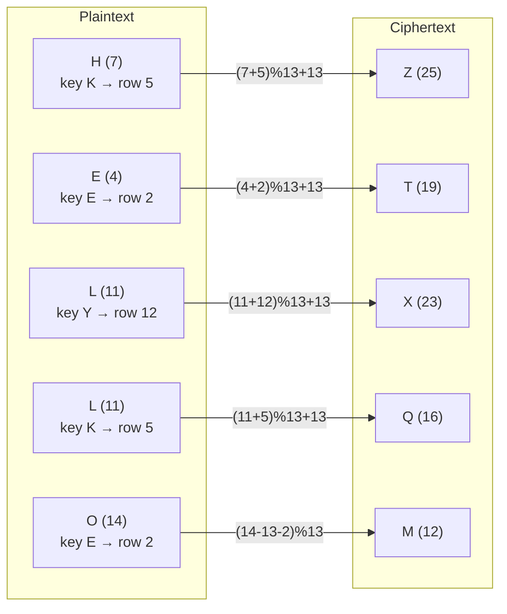
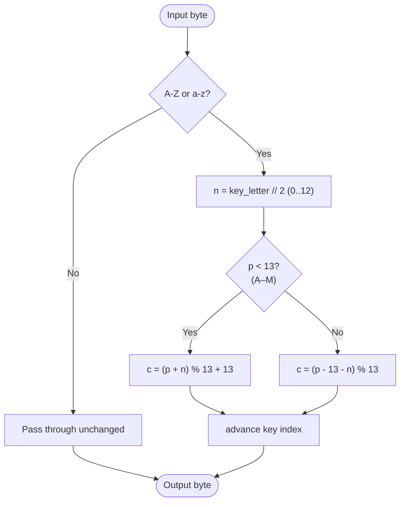

# Porta Cipher

> A reciprocal polyalphabetic substitution cipher using a 13-row tableau, where each key letter selects one of 13 alphabets that map A–M to N–Z and back.

## Overview

The Porta cipher was described by the Italian polymath Giambattista della Porta in his 1563 treatise *De Furtivis Literarum Notis*. It is one of the earliest polyalphabetic ciphers and predates the Vigenère cipher. Its defining feature is that it is **reciprocal** — the same procedure both encrypts and decrypts — which made it convenient to use by hand. Key letters are paired (A with B, C with D, …), so there are only 13 distinct cipher alphabets.

## How It Works

The key is repeated over the plaintext, Vigenère-style. Each key letter selects a row of the Porta tableau via `row = key_letter // 2`, giving an index from 0 to 12. Within a row, the first half of the alphabet (A–M) is shifted into the second half (N–Z), and the second half maps back into the first — so every row is its own inverse. For a plaintext letter `p` and row `n`: if `p` is in A–M, the cipher letter is `(p + n) mod 13 + 13`; if `p` is in N–Z, it is `(p − 13 − n) mod 13`. Because the two halves swap, applying the rule twice returns the original letter.

### Tableau (key letter → row)

```
KEY | A B C D E F G H I J K L M
----+---------------------------
A,B | N O P Q R S T U V W X Y Z   (row 0)
C,D | O P Q R S T U V W X Y Z N   (row 1)
E,F | P Q R S T U V W X Y Z N O   (row 2)
 …  |
K,L | S T U V W X Y Z N O P Q R   (row 5)
 …  |
Y,Z | Z N O P Q R S T U V W X Y   (row 12)
```

### Letter-by-letter example (`HELLO`, key `KEY`)



### Per-letter algorithm



## API

```python
from hordekit.crypto.classical.substitution import Porta

cipher = Porta(b"KEY")

# Reciprocal — encrypt and decrypt are the same operation
cipher.encrypt(b"HELLO")  # -> HordeResult(b"ZTXQM")
cipher.decrypt(b"ZTXQM")  # -> HordeResult(b"HELLO")

# Non-alpha bytes pass through; the key only advances on letters
cipher.encrypt(b"HE LL O")  # -> HordeResult(b"ZT XQ M")
```

### Parameters

| Parameter | Type    | Description                                                          |
|-----------|---------|---------------------------------------------------------------------|
| `key`     | `bytes` | Keyword — ASCII letters only (non-letters raise `ValueError`), non-empty |

### Chaining

```python
from hordekit.crypto.classical.substitution import Porta, Caesar

result = (
    Porta(b"SECRET").encrypt(b"ATTACKATDAWN")
    .pipe(Caesar, shift=3)
    .as_hex()
)
```

## Known Attacks

| Attack | When applicable |
|--------|----------------|
| [Kasiski Test](../../attacks/vigenere/kasiski.md) | Estimates key length from repeated ciphertext segments — applies to any periodic polyalphabetic cipher |
| [Index of Coincidence](../../attacks/substitution/ioc.md) | Detects the polyalphabetic structure and helps estimate the key length |
| [Frequency Analysis](../../attacks/substitution/frequency.md) | Per-column monogram analysis once the key length is known (each column is a fixed Porta alphabet) |
| [Dictionary Attack](../../attacks/generic/dictionary.md) | When the keyword is a common English word |

> **Note:** Porta is **not** brute-forceable by enumeration — like Vigenère, the keyspace grows with key length. The standard approach is the same as for Vigenère: recover the key length (Kasiski / IoC), then solve each column as a simple substitution. Note that because key letters are paired, the effective per-position keyspace is only 13, slightly weakening it relative to Vigenère.

## References

- [Wikipedia — Tabula recta (Porta cipher)](https://en.wikipedia.org/wiki/Tabula_recta)
- della Porta, G. *De Furtivis Literarum Notis*, 1563.
- Kahn, D. *The Codebreakers*, Scribner, 1996.
