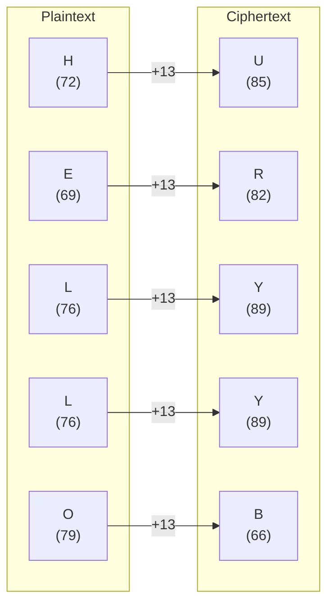
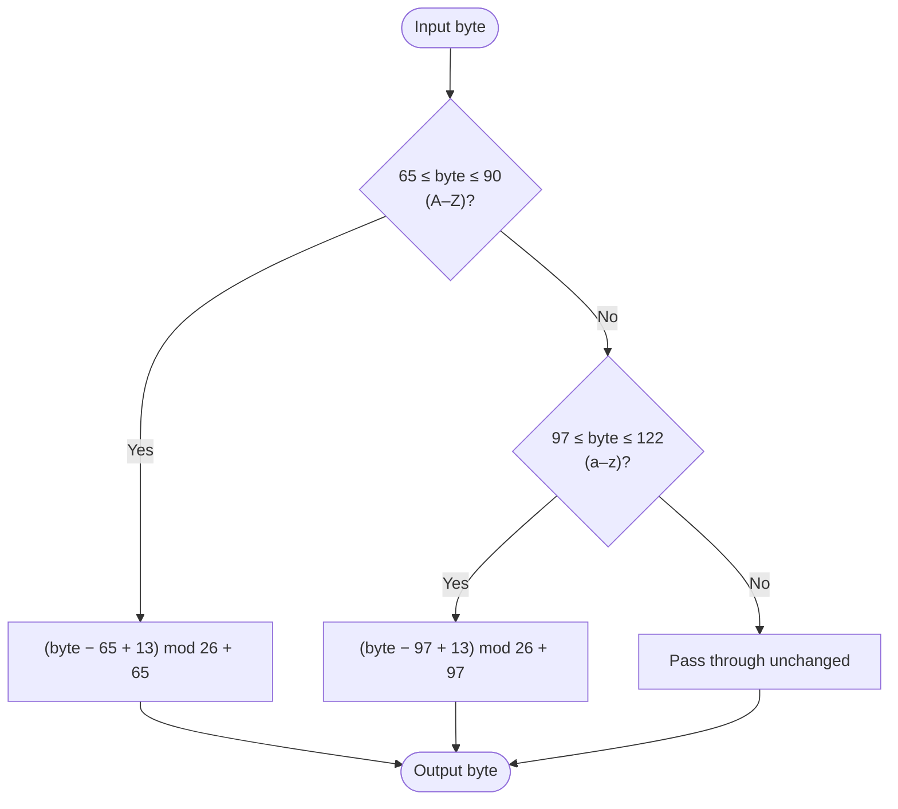

# ROT13

> A special case of the Caesar cipher with a fixed shift of 13 — applying it twice returns the original text.

## Overview

ROT13 ("rotate by 13") became popular in the early 1980s as a simple way to obscure text in Usenet posts — spoilers, punchlines, offensive content — without any intent of real security. Because the Latin alphabet has 26 letters, shifting by 13 is self-inverse: encrypting and decrypting are the same operation. ROT13 is implemented as `Caesar(shift=13)`.

## How It Works

Every letter is shifted 13 positions forward in the alphabet, wrapping around. Non-letter bytes pass through unchanged. Applying ROT13 to already-encrypted text always recovers the original.

### Letter-by-letter example



### Per-byte algorithm



## API

```python
from hordekit.crypto.classical.substitution import ROT13

r = ROT13()
r.encrypt(b"Hello, World!")   # -> HordeResult → b"Uryyb, Jbeyq!"
r.decrypt(b"Uryyb, Jbeyq!")   # -> HordeResult → b"Hello, World!"

# encrypt == decrypt
r.encrypt(r.encrypt(b"Hello")) == b"Hello"  # True
```

### Chaining

```python
from hordekit.crypto.classical.substitution import ROT13, Caesar

result = (
    Caesar(shift=3).encrypt(b"Hello")
    .pipe(ROT13)
    .as_str()
)
```

## Known Attacks

| Attack | When applicable |
|--------|----------------|
| Trivial — apply ROT13 again (`ROT13().decrypt(ct)`) | Always; there is exactly one key |
| [Brute Force](../../attacks/generic/brute_force.md) | Automated version of the trivial case |
| [Frequency Analysis](../../attacks/substitution/frequency.md) | Ciphertext > ~100 characters |

## References

- [ROT13 — Wikipedia](https://en.wikipedia.org/wiki/ROT13)
