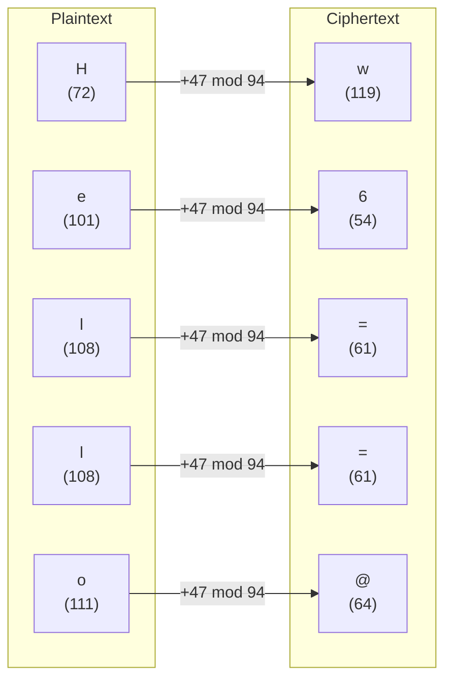
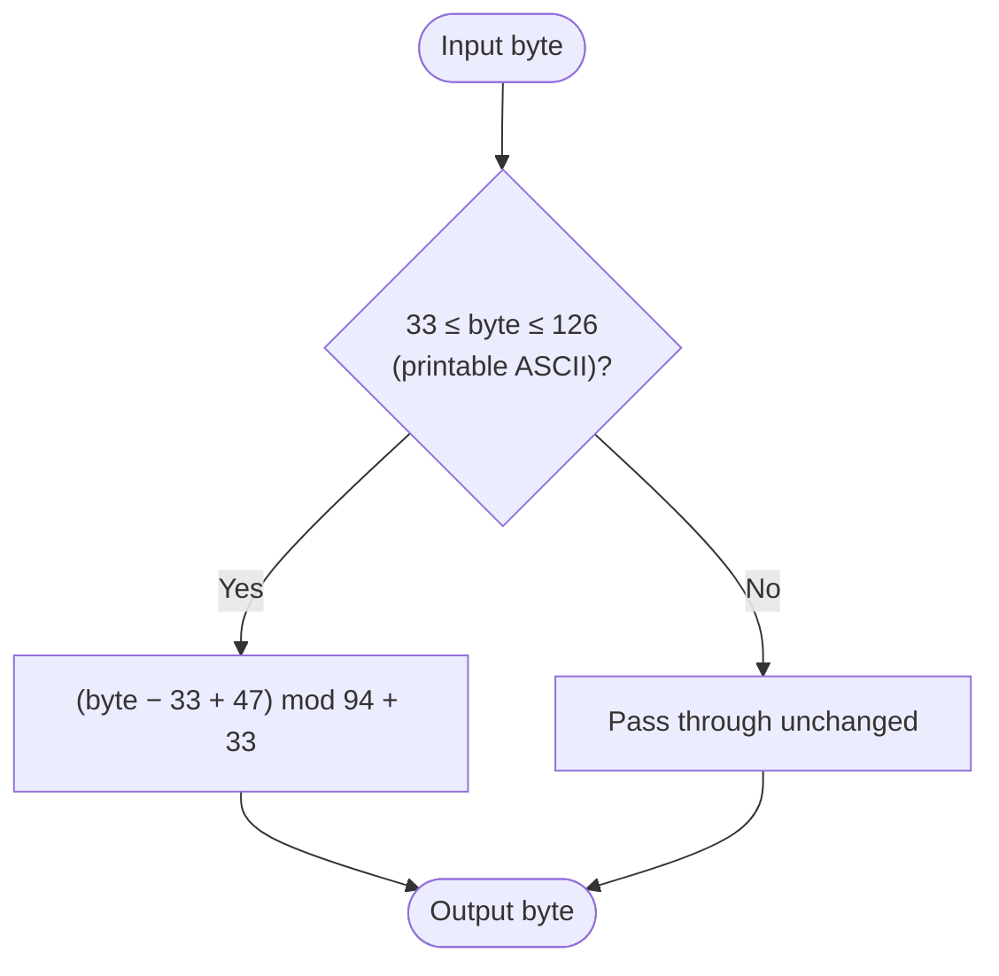

# ROT47

> An extension of ROT13 that rotates all 94 printable ASCII characters, not just letters.

## Overview

ROT47 operates on the full printable ASCII range (characters 33–126: `!` through `~`), shifting each character by 47 positions within that 94-character space. Like ROT13, it is self-inverse. It was designed to obfuscate text that contains digits and punctuation, which ROT13 leaves unchanged.

## How It Works

Each byte in the printable ASCII range (`!` = 33 to `~` = 126) is shifted by 47, wrapping around the 94-character window. Bytes outside this range — control characters, spaces, bytes above 126 — pass through unchanged.

### Letter-by-letter example



### Per-byte algorithm



## API

```python
from hordekit.crypto.classical.substitution import ROT47

r = ROT47()
r.encrypt(b"Hello, World!")   # -> HordeResult → b"w6==@[ (@C=5P"
r.decrypt(b"w6==@[ (@C=5P")   # -> HordeResult → b"Hello, World!"

# self-inverse
r.encrypt(r.encrypt(b"Hello!")) == b"Hello!"  # True
```

### Chaining

```python
from hordekit.crypto.classical.substitution import ROT47

result = (
    ROT47().encrypt(b"flag{secret_123}")
    .as_str()
)
```

## Known Attacks

| Attack | When applicable |
|--------|----------------|
| Trivial — apply ROT47 again | Always; there is exactly one key |

## References

- [ROT47 — Wikipedia](https://en.wikipedia.org/wiki/ROT13#Variants)
