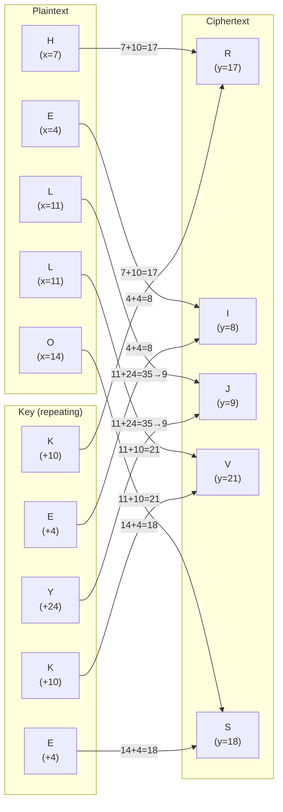
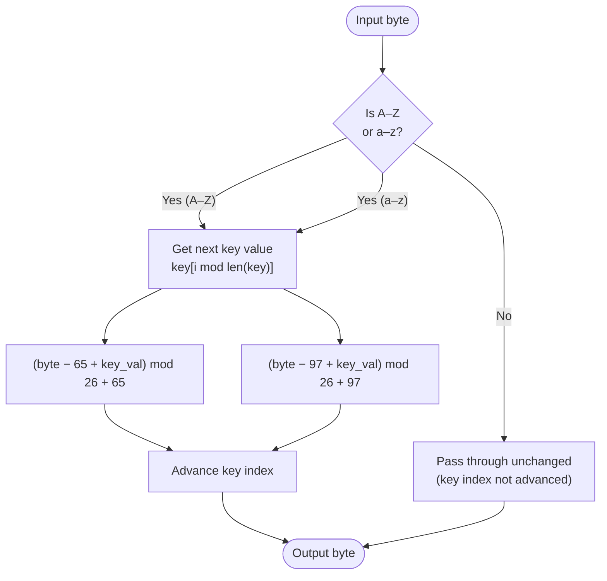

# Vigenère Cipher

> A polyalphabetic substitution cipher that uses a repeating keyword to shift each letter by a different amount.

## Overview

The Vigenère cipher was described by Giovan Battista Bellaso in 1553 and later misattributed to Blaise de Vigenère. It was considered unbreakable for three centuries — earning the nickname *le chiffre indéchiffrable* — until Charles Babbage and Friedrich Kasiski independently cracked it in the 19th century. Unlike monoalphabetic ciphers, it applies a different shift to each letter based on a repeating keyword, which defeats simple frequency analysis.

## How It Works

The keyword is repeated to match the length of the plaintext (skipping non-letter characters). Each plaintext letter is shifted by the corresponding key letter's position in the alphabet (A=0, B=1, …, Z=25). Decryption subtracts the shift instead.

### Letter-by-letter example (key = "KEY")



### Per-byte algorithm



## API

```python
from hordekit.crypto.classical.substitution import Vigenere

cipher = Vigenere(b"KEY")
cipher.encrypt(b"HELLO")   # -> HordeResult → b"RIJVS"
cipher.decrypt(b"RIJVS")   # -> HordeResult → b"HELLO"
```

### Parameters

| Parameter | Type | Description |
|-----------|------|-------------|
| `key` | `bytes` | ASCII letters only (upper or lower). Repeated to match plaintext length. |

### Chaining

```python
from hordekit.crypto.classical.substitution import Vigenere

result = (
    Vigenere(b"SECRET").encrypt(b"Attack at dawn")
    .as_base64()
)
```

## Known Attacks

| Attack | When applicable |
|--------|----------------|
| Kasiski test | Identifies key length from repeated ciphertext patterns |
| Index of coincidence | Confirms key length and detects polyalphabetic cipher |
| Frequency analysis per position | Once key length is known, each column is a Caesar cipher |

!!! note
    Vigenere does not implement `possible_keys()` — the key space is too large for brute force. Use Kasiski + per-column frequency analysis instead.

## References

- [Vigenère cipher — Wikipedia](https://en.wikipedia.org/wiki/Vigen%C3%A8re_cipher)
- [Practical Cryptography — Vigenère Cipher](http://practicalcryptography.com/ciphers/vigenere-gronsfeld-and-autokey-cipher/)
- [Cryptanalysis of the Vigenère Cipher](http://practicalcryptography.com/cryptanalysis/stochastic-searching/cryptanalysis-vigenere-cipher/)
